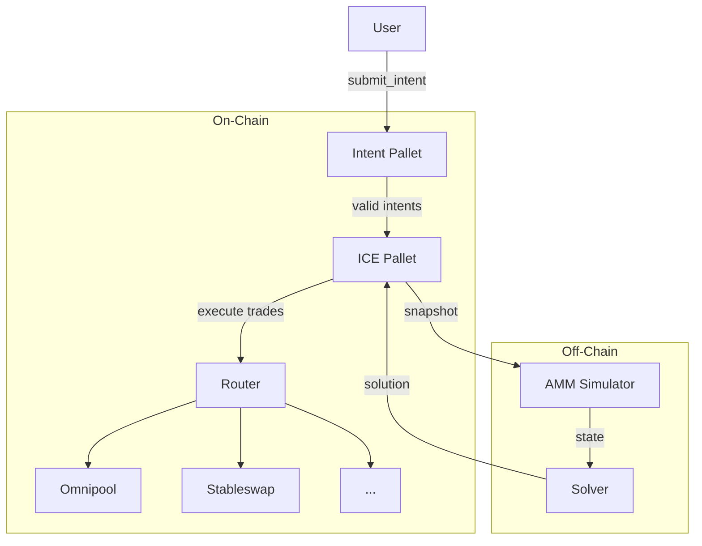
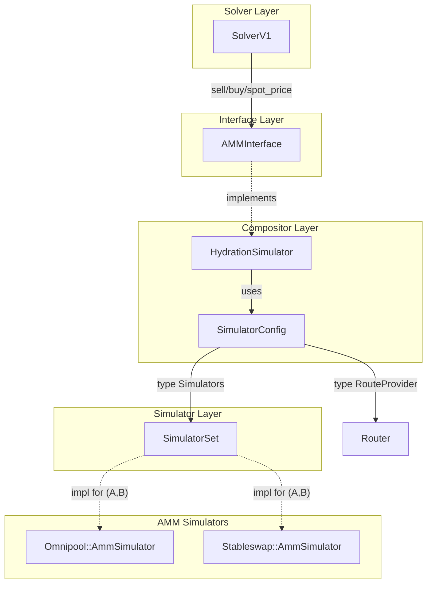
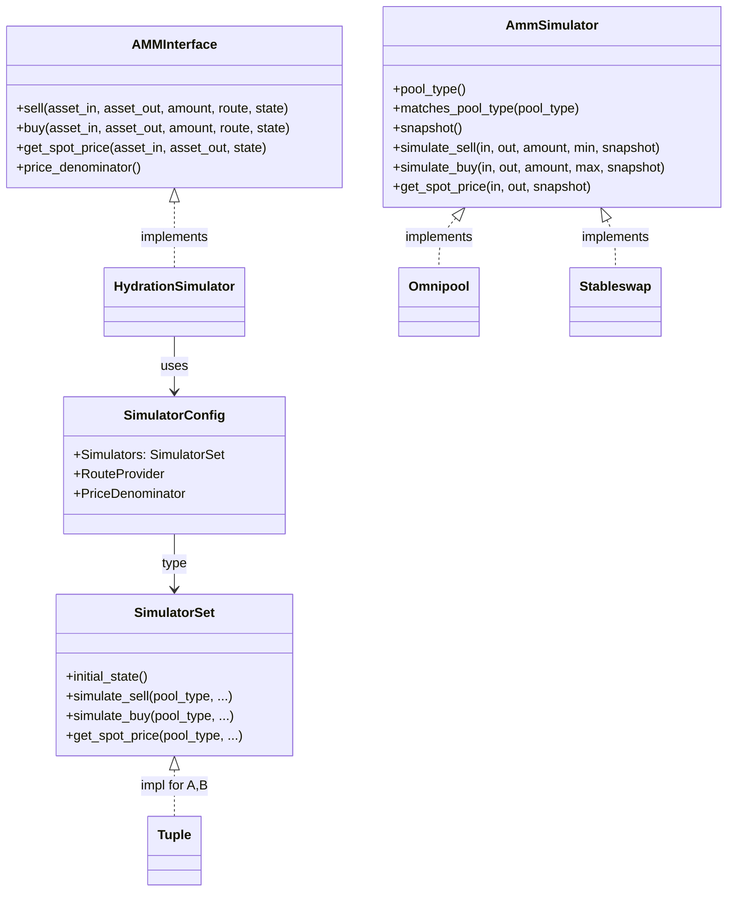
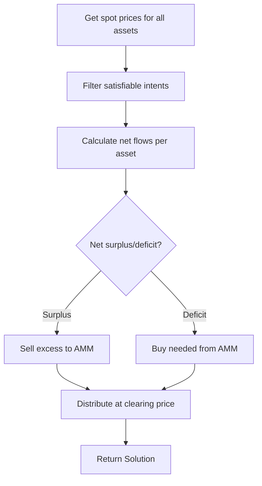

# ICE Solver Architecture

## Overview

The ICE (Intent Componsing Engine) system enables intent-based trading on Hydration. Users submit trade intents, and an off-chain solver finds optimal execution paths, potentially matching intents directly to reduce AMM fees and slippage.

## Core Components



## Component Responsibilities

| Component | Role |
|-----------|------|
| **Intent Pallet** | Stores user intents with deadlines and parameters |
| **ICE Pallet** | Orchestrates solving, validates and executes solutions |
| **Simulator** | Captures AMM state snapshots, simulates trades off-chain |
| **Solver** | Finds optimal intent resolution with matching algorithm |

## Traits and Integration



## Trait Hierarchy



## Solver Algorithm (Matching)



**Matching Benefit:**
- Without matching: Each intent trades through AMM separately
- With matching: Matching intents settle directly, only net imbalance hits AMM
- Result: Lower fees, reduced slippage, better execution for all users

## Solution Structure

```rust
Solution {
    resolved_intents: Vec<ResolvedIntent>,  // What each user gets
    trades: Vec<PoolTrade>,                  // AMM trades to execute
    clearing_prices: Map<Asset, Price>,      // Uniform prices used
    score: u128,                             // Solution quality metric
}
```

## Key Design Decisions

1. **Snapshot-based Simulation** - Capture chain state once, simulate multiple scenarios off-chain
2. **Tuple-based SimulatorSet** - Compose multiple AMM simulators with automatic type-safe dispatch
3. **Router Integration** - Use on-chain router for route discovery, simulator for execution
4. **HDX as Price Denominator** - All prices computed relative to HDX for intent matching
5. **Uniform Clearing Price** - All matched intents execute at same price for fairness
