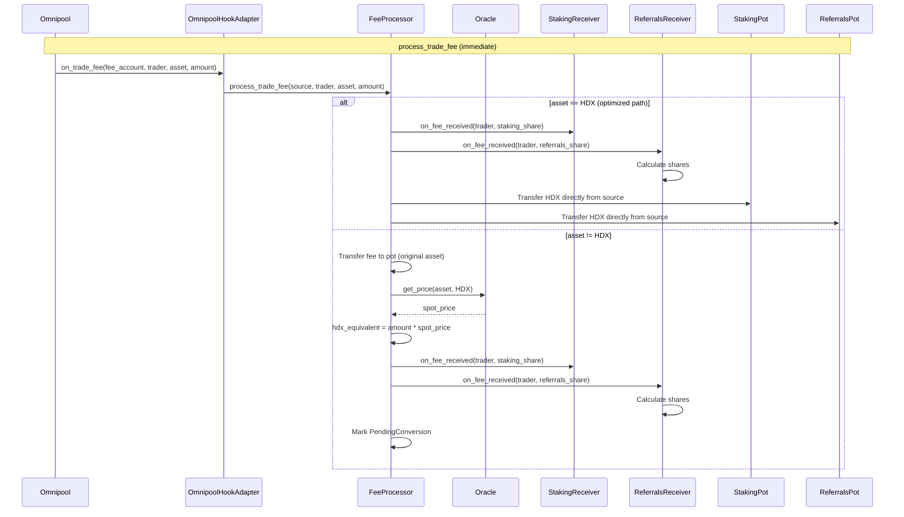
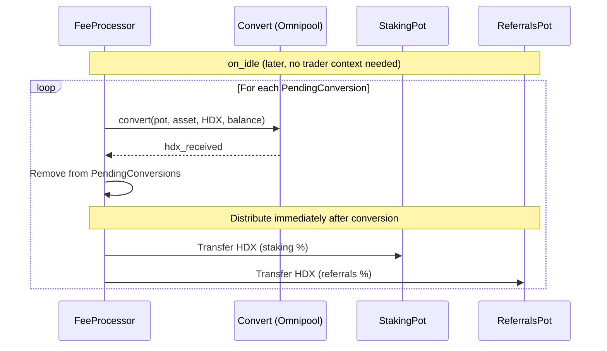
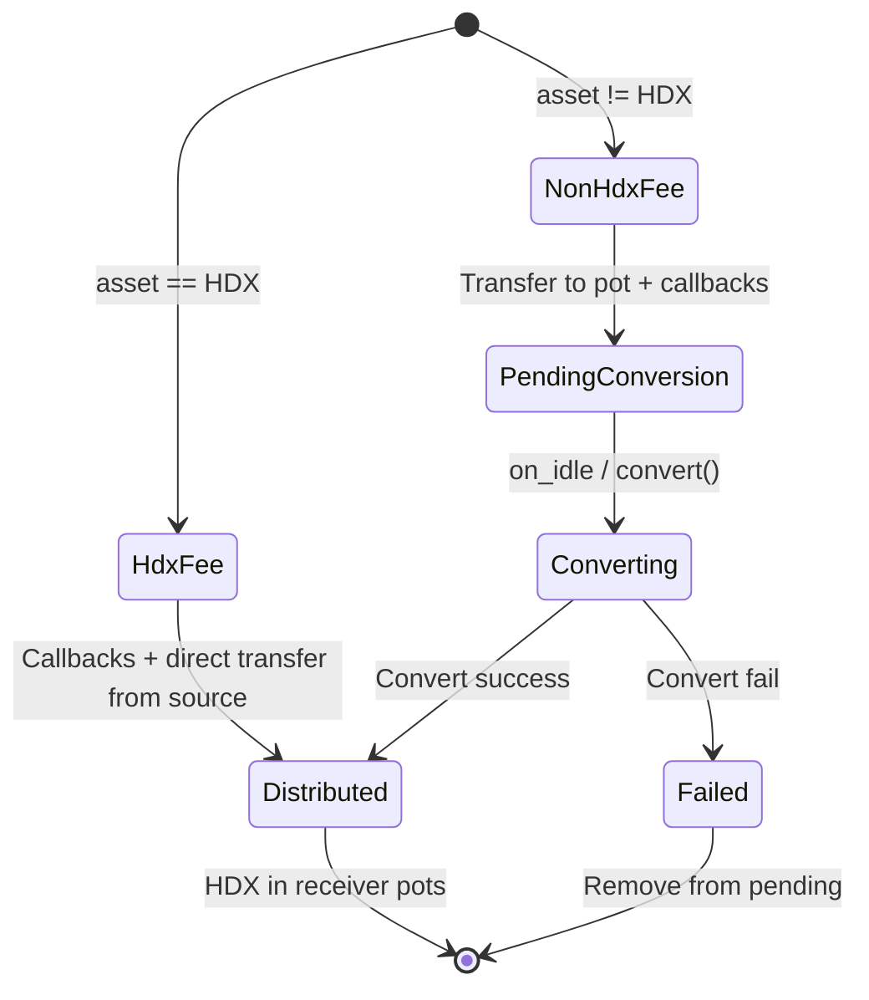

# pallet-fee-processor Specification

## 1. Overview

### Purpose

The Fee Processor pallet centralizes trading fee handling, currently spread between the referrals and staking pallets. It:

1. **Receives** all trading fees from Omnipool trades
2. **Converts** non-HDX fees to HDX (via Omnipool/Router)
3. **Distributes** HDX to configured pots by percentage

### Current State (Before Refactor)

```
Omnipool Trade
    │
    ▼
on_trade_fee hook (runtime/adapters/src/lib.rs:480-505)
    │
    ├─► Non-native assets: Referrals::process_trade_fee()
    │       - Calculates shares for referrer/trader/external
    │       - Tracks PendingConversions for non-HDX
    │       - Converts via on_idle
    │
    └─► Native (HDX): Staking::process_trade_fee()
            - Simple transfer to staking pot
```

### Target State (After Refactor)

```
Omnipool Trade
    │
    ▼
on_trade_fee hook
    │
    ▼
FeeProcessor::process_trade_fee(source, trader, asset, amount)
    │
    ├─► If asset == HDX:
    │       ├─► Execute callbacks with trader context
    │       └─► Distribute directly from source to receiver pots (optimized)
    │
    └─► If asset != HDX:
            ├─► Transfer fee to fee-processor pot
            ├─► Calculate HDX equivalent using SPOT PRICE
            ├─► Execute OPTIMISTIC CALLBACKS:
            │       ├─► StakingReceiver.on_fee_received(trader, staking_amount)
            │       └─► ReferralsReceiver.on_fee_received(trader, referrals_amount)
            └─► Mark for conversion

    ▼ (later, via on_idle or manual convert())
    │
    └─► Convert pending asset to HDX (actual swap) → Distribute to pots
```

**Key Design Decision**: Callbacks are called **immediately** during `process_trade_fee` with
the spot-price-converted HDX amount. This is "optimistic" - telling receivers what amount
they will eventually receive. This preserves trader context which would be lost if callbacks
happened during batch distribution.

### Dependencies

- None (foundation component)
- **Used by**: `pallet-referrals` (via callback), `pallet-staking` (via pot transfer)

---

## 2. Configuration

```rust
#[pallet::config]
pub trait Config: frame_system::Config {
    /// The overarching event type.
    type RuntimeEvent: From<Event<Self>> + IsType<<Self as frame_system::Config>::RuntimeEvent>;

    /// Asset ID type.
    type AssetId: Member
        + Parameter
        + Copy
        + MaybeSerializeDeserialize
        + MaxEncodedLen
        + Ord;

    /// Multi-currency support for transfers.
    type Currency: Mutate<Self::AccountId, AssetId = Self::AssetId, Balance = Balance>
        + Inspect<Self::AccountId, AssetId = Self::AssetId, Balance = Balance>;

    /// Converter for swapping assets to HDX.
    /// Same trait as used in pallet-referrals.
    type Convert: Convert<Self::AccountId, Self::AssetId, Balance, Error = DispatchError>;

    /// Spot price provider for calculating HDX equivalent before conversion.
    /// Used for optimistic callbacks - actual swap may yield different amount.
    type PriceProvider: PriceProvider<Self::AssetId, Price = EmaPrice>;

    /// Pallet ID for the fee accumulation account.
    #[pallet::constant]
    type PalletId: Get<PalletId>;

    /// HDX asset ID (target asset for conversions).
    #[pallet::constant]
    type HdxAssetId: Get<Self::AssetId>;

    /// LRNA asset ID (hub asset, fees in LRNA are skipped).
    #[pallet::constant]
    type LrnaAssetId: Get<Self::AssetId>;

    /// Minimum amount for conversion (prevent dust conversions).
    #[pallet::constant]
    type MinConversionAmount: Get<Balance>;

    /// Maximum conversions per on_idle call.
    #[pallet::constant]
    type MaxConversionsPerBlock: Get<u32>;

    /// Tuple of fee receivers implementing FeeReceiver trait.
    /// Configured at runtime level, not dynamically registered.
    /// Use tuple of receivers: (StakingFeeReceiver, ReferralsFeeReceiver)
    type FeeReceivers: FeeReceiver<Self::AccountId, Balance, Error = DispatchError>;

    /// Weight information.
    type WeightInfo: WeightInfo;
}
```

### Constants

| Constant | Type | Description | Suggested Value |
|----------|------|-------------|-----------------|
| `PalletId` | `PalletId` | Pallet account identifier | `*b"feeproc/"` |
| `HdxAssetId` | `AssetId` | Native HDX asset | `0` |
| `LrnaAssetId` | `AssetId` | Hub asset (LRNA) | `1` |
| `MinConversionAmount` | `Balance` | Min for conversion | `1_000_000_000_000` (1 HDX equivalent) |
| `MaxConversionsPerBlock` | `u32` | Max conversions per on_idle | `5` |

---

## 3. Storage Schema

```rust
/// Assets pending conversion to HDX.
/// Contains assets that have been received but not yet converted.
#[pallet::storage]
#[pallet::getter(fn pending_conversions)]
pub type PendingConversions<T: Config> = CountedStorageMap<
    _,
    Blake2_128Concat,
    T::AssetId,
    (),
    OptionQuery
>;
```

---

## 4. Types and Data Structures

### Convert Trait (reused from referrals)

```rust
/// Trait for converting assets. Reused from pallet-referrals.
/// Can be moved to shared traits crate if needed.
pub trait Convert<AccountId, AssetId, Balance> {
    type Error;

    fn convert(
        who: AccountId,
        asset_from: AssetId,
        asset_to: AssetId,
        amount: Balance,
    ) -> Result<Balance, Self::Error>;
}
```

### FeeReceiver Trait

Single trait for fee distribution receivers. Tuple implementations are auto-generated
using `impl_trait_for_tuples` macro (same pattern as `TradeExecution` in router).

The fee processor handles all transfers - it uses `destinations()` to get the list
of accounts and percentages for distribution.

```rust
/// Trait for fee distribution recipients.
/// Implemented by each fee receiver (staking, referrals, future gigahdx).
/// Tuple implementations are generated automatically via macro.
pub trait FeeReceiver<AccountId, Balance> {
    type Error;

    /// Account where HDX should be deposited (for individual receiver).
    fn destination() -> AccountId;

    /// Percentage of total fees to receive (in Permill).
    fn percentage() -> Permill;

    /// Returns all (destination, percentage) pairs for distribution.
    /// - Individual receiver: returns `vec![(destination(), percentage())]`
    /// - Tuple: returns combined list from all receivers
    fn destinations() -> Vec<(AccountId, Permill)> {
        vec![(Self::destination(), Self::percentage())]
    }

    /// Optimistic callback when fees are calculated.
    /// Called during process_trade_fee with trader context.
    ///
    /// # Arguments
    /// * `trader` - Optional trader account (present for trade fees).
    /// * `amount` - HDX amount this receiver will get (spot-price converted).
    ///
    /// # Note
    /// This is called BEFORE actual transfer. The amount is based on
    /// spot price conversion and may differ slightly from final transfer.
    fn on_fee_received(
        trader: Option<AccountId>,
        amount: Balance,
    ) -> Result<(), Self::Error>;
}
```

### Tuple Implementation (auto-generated via macro)

```rust
use impl_trait_for_tuples::impl_for_tuples;

/// Auto-generate tuple implementations for 1 to 6 receivers.
/// Pattern follows router's TradeExecution trait.
#[impl_for_tuples(1, 6)]
impl<AccountId: Clone, Balance: Copy + Zero + Saturating> FeeReceiver<AccountId, Balance> for Tuple {
    for_tuples!( where #(Tuple: FeeReceiver<AccountId, Balance, Error=DispatchError>)* );
    type Error = DispatchError;

    fn destination() -> AccountId {
        // Not meaningful for tuple - use destinations() instead
        panic!("destination() should not be called on tuple")
    }

    fn percentage() -> Permill {
        // Sum of all receiver percentages
        let mut total = Permill::zero();
        for_tuples!( #( total = total.saturating_add(Tuple::percentage()); )* );
        total
    }

    fn destinations() -> Vec<(AccountId, Permill)> {
        let mut result = Vec::new();
        for_tuples!( #( result.extend(Tuple::destinations()); )* );
        result
    }

    fn on_fee_received(
        trader: Option<AccountId>,
        total: Balance,
    ) -> Result<(), Self::Error> {
        // Call callback on each receiver with their portion
        for_tuples!(
            #(
                let amount = Tuple::percentage().mul_floor(total);
                if !amount.is_zero() {
                    Tuple::on_fee_received(trader.clone(), amount)?;
                }
            )*
        );
        Ok(())
    }
}

### Individual Receiver Implementations

Defined in runtime/adapters (see Section 9).

---

## 5. Functions

### 5.1 `process_trade_fee` (Public)

Main entry point called by Omnipool hook.

```rust
impl<T: Config> Pallet<T> {
    /// Process a trade fee from Omnipool.
    ///
    /// This function:
    /// 1. If HDX: distribute directly from source to receiver pots (no intermediate transfer)
    /// 2. If non-HDX: transfer to pallet pot, calculate HDX equivalent via spot price,
    ///    execute optimistic callbacks, mark for conversion
    ///
    /// # Arguments
    /// * `source` - Account holding the fee (fee collector).
    /// * `trader` - Account that executed the trade (for referral lookup).
    /// * `asset` - Asset ID of the fee.
    /// * `amount` - Fee amount in original asset.
    ///
    /// # Returns
    /// * `Ok(Some((amount, pot_account)))` - Fee processed successfully.
    /// * `Ok(None)` - Fee skipped (e.g., LRNA).
    pub fn process_trade_fee(
        source: T::AccountId,
        trader: T::AccountId,
        asset: T::AssetId,
        amount: Balance,
    ) -> Result<Option<(Balance, T::AccountId)>, DispatchError> {
        // Skip LRNA fees
        if asset == T::LrnaAssetId::get() {
            return Ok(None);
        }

        if asset == T::HdxAssetId::get() {
            // Already HDX - execute callbacks and distribute directly from source
            T::FeeReceivers::on_fee_received(Some(trader.clone()), amount)?;
            Self::distribute_to_pots(&source, amount)?;

            Self::deposit_event(Event::FeeReceived {
                asset,
                amount,
                hdx_equivalent: amount,
                trader: Some(trader),
            });

            // Return None for pot since we distributed directly
            Ok(None)
        } else {
            // Non-HDX asset - transfer to pot, calculate spot price, mark for conversion
            let pot = Self::pot_account_id();

            T::Currency::transfer(
                asset,
                &source,
                &pot,
                amount,
                Preservation::Preserve,
            )?;

            // Calculate HDX equivalent using SPOT PRICE (not actual swap)
            let hdx_equivalent = Self::calculate_hdx_equivalent(asset, amount)?;

            // Execute OPTIMISTIC CALLBACKS with trader context
            T::FeeReceivers::on_fee_received(Some(trader.clone()), hdx_equivalent)?;

            // Mark for conversion (on_idle will convert and distribute)
            PendingConversions::<T>::insert(asset, ());

            Self::deposit_event(Event::FeeReceived {
                asset,
                amount,
                hdx_equivalent,
                trader: Some(trader),
            });

            Ok(Some((amount, pot)))
        }
    }

    /// Calculate HDX equivalent using spot price from oracle.
    fn calculate_hdx_equivalent(
        asset: T::AssetId,
        amount: Balance,
    ) -> Result<Balance, DispatchError> {
        // Get spot price: asset -> HDX
        let price = T::PriceProvider::get_price(asset, T::HdxAssetId::get())
            .ok_or(Error::<T>::PriceNotAvailable)?;

        // Convert: hdx_amount = amount * price.n / price.d
        let hdx_amount = multiply_by_rational_with_rounding(
            amount,
            price.n,
            price.d,
            Rounding::Down,
        ).ok_or(Error::<T>::Arithmetic)?;

        Ok(hdx_amount)
    }
}
```

### 5.2 `convert` (Extrinsic)

Manual conversion trigger.

```rust
#[pallet::call_index(0)]
#[pallet::weight(T::WeightInfo::convert())]
pub fn convert(
    origin: OriginFor<T>,
    asset_id: T::AssetId,
) -> DispatchResult {
    ensure_signed(origin)?;

    Self::do_convert(asset_id)
}

impl<T: Config> Pallet<T> {
    fn do_convert(asset_id: T::AssetId) -> DispatchResult {
        ensure!(asset_id != T::HdxAssetId::get(), Error::<T>::AlreadyHdx);

        let pot = Self::pot_account_id();
        let balance = T::Currency::balance(asset_id, &pot);

        ensure!(
            balance >= T::MinConversionAmount::get(),
            Error::<T>::AmountTooLow
        );

        // Execute swap (same approach as referrals)
        let hdx_received = T::Convert::convert(
            pot.clone(),
            asset_id,
            T::HdxAssetId::get(),
            balance,
        )?;

        // Remove from pending
        PendingConversions::<T>::remove(asset_id);

        // Distribute immediately to pots
        Self::distribute_to_pots(&pot, hdx_received)?;

        Self::deposit_event(Event::Converted {
            asset_id,
            amount_in: balance,
            hdx_out: hdx_received,
        });

        Ok(())
    }
}
```

### 5.3 Helper Functions

```rust
impl<T: Config> Pallet<T> {
    /// Pallet account holding fees pending conversion.
    pub fn pot_account_id() -> T::AccountId {
        T::PalletId::get().into_account_truncating()
    }

    /// Distribute HDX to all receiver pots according to their percentages.
    fn distribute_to_pots(
        source: &T::AccountId,
        total: Balance,
    ) -> DispatchResult {
        let destinations = T::FeeReceivers::destinations();

        for (dest, percentage) in destinations {
            let amount = percentage.mul_floor(total);
            if !amount.is_zero() {
                T::Currency::transfer(
                    T::HdxAssetId::get(),
                    source,
                    &dest,
                    amount,
                    Preservation::Preserve,
                )?;
            }
        }

        Ok(())
    }
}
```

---

## 6. Events

```rust
#[pallet::event]
#[pallet::generate_deposit(pub(super) fn deposit_event)]
pub enum Event<T: Config> {
    /// Fee received from trade.
    /// Callbacks have been executed with hdx_equivalent amount.
    FeeReceived {
        asset: T::AssetId,
        amount: Balance,
        /// HDX equivalent calculated using spot price
        hdx_equivalent: Balance,
        trader: Option<T::AccountId>,
    },

    /// Asset converted to HDX and distributed to pots.
    Converted {
        asset_id: T::AssetId,
        amount_in: Balance,
        hdx_out: Balance,
    },

    /// Conversion failed (logged but not blocking).
    ConversionFailed {
        asset_id: T::AssetId,
        reason: DispatchError,
    },
}
```

---

## 7. Errors

```rust
#[pallet::error]
pub enum Error<T> {
    /// Asset is already HDX, no conversion needed.
    AlreadyHdx,

    /// Amount too low for conversion.
    AmountTooLow,

    /// Conversion failed.
    ConversionFailed,

    /// Transfer failed.
    TransferFailed,

    /// Spot price not available for asset pair.
    PriceNotAvailable,

    /// Arithmetic overflow/underflow.
    Arithmetic,
}
```

---

## 8. Hooks

### on_idle

```rust
#[pallet::hooks]
impl<T: Config> Hooks<BlockNumberFor<T>> for Pallet<T> {
    fn on_idle(_n: BlockNumberFor<T>, remaining_weight: Weight) -> Weight {
        let convert_weight = T::WeightInfo::convert();

        if remaining_weight.ref_time() < convert_weight.ref_time() {
            return Weight::zero();
        }

        let mut used_weight = Weight::zero();

        // Convert pending assets to HDX and distribute immediately
        // Note: Callbacks were already called during process_trade_fee
        let max_conversions = remaining_weight
            .ref_time()
            .checked_div(convert_weight.ref_time())
            .unwrap_or(0)
            .min(T::MaxConversionsPerBlock::get() as u64);

        for asset_id in PendingConversions::<T>::iter_keys()
            .take(max_conversions as usize)
        {
            match Self::do_convert(asset_id) {
                Ok(_) => {}
                Err(e) => {
                    // Log but don't fail - remove from pending anyway
                    Self::deposit_event(Event::ConversionFailed {
                        asset_id,
                        reason: e,
                    });
                    PendingConversions::<T>::remove(asset_id);
                }
            }
            used_weight = used_weight.saturating_add(convert_weight);
        }

        used_weight
    }
}
```

---

## 9. Runtime Integration

### FeeReceiver Implementations

Define in `runtime/hydradx/src/` or `runtime/adapters/src/`:

```rust
/// Staking fee receiver - simple accumulation, no callback needed.
pub struct StakingFeeReceiver<T>(PhantomData<T>);

impl<T: pallet_staking::Config> FeeReceiver<T::AccountId, Balance> for StakingFeeReceiver<T> {
    type Error = DispatchError;

    fn destination() -> T::AccountId {
        pallet_staking::Pallet::<T>::pot_account_id()
    }

    fn percentage() -> Permill {
        // TBD: Actual percentage from product requirements
        Permill::from_percent(70)
    }

    fn on_fee_received(
        _trader: Option<T::AccountId>,
        _amount: Balance,
    ) -> Result<(), Self::Error> {
        // Staking doesn't need callback, just accumulates HDX in pot
        Ok(())
    }
}

/// Referrals fee receiver - needs trader context for share calculation.
pub struct ReferralsFeeReceiver<T>(PhantomData<T>);

impl<T: pallet_referrals::Config> FeeReceiver<T::AccountId, Balance> for ReferralsFeeReceiver<T> {
    type Error = DispatchError;

    fn destination() -> T::AccountId {
        pallet_referrals::Pallet::<T>::pot_account_id()
    }

    fn percentage() -> Permill {
        // TBD: Actual percentage from product requirements
        Permill::from_percent(30)
    }

    fn on_fee_received(
        trader: Option<T::AccountId>,
        amount: Balance,
    ) -> Result<(), Self::Error> {
        if let Some(trader) = trader {
            // Notify referrals pallet about incoming fee (optimistic callback)
            // Referrals calculates shares based on this amount
            pallet_referrals::Pallet::<T>::on_fee_received(trader, amount)
        } else {
            // No trader context (e.g., protocol fees), skip share calculation
            Ok(())
        }
    }
}
```

### Runtime Config

```rust
impl pallet_fee_processor::Config for Runtime {
    type RuntimeEvent = RuntimeEvent;
    type AssetId = AssetId;
    type Currency = Currencies;
    type Convert = OmnipoolRouteExecutor<Runtime>;  // Same as referrals
    type PriceProvider = OraclePriceProvider;  // For spot price
    type PalletId = FeeProcessorPalletId;
    type HdxAssetId = NativeAssetId;
    type LrnaAssetId = LrnaAssetId;
    type MinConversionAmount = MinFeeConversionAmount;
    type MaxConversionsPerBlock = MaxFeeConversionsPerBlock;
    // Tuple of receivers - auto-implements FeeReceiver via macro
    type FeeReceivers = (
        StakingFeeReceiver<Runtime>,
        ReferralsFeeReceiver<Runtime>,
    );
    type WeightInfo = weights::pallet_fee_processor::HydraWeight<Runtime>;
}

parameter_types! {
    pub const FeeProcessorPalletId: PalletId = PalletId(*b"feeproc/");
    pub const MinFeeConversionAmount: Balance = 1_000_000_000_000; // 1 HDX equivalent
    pub const MaxFeeConversionsPerBlock: u32 = 5;
}
```

### Hook Adapter Update

```rust
// In runtime/adapters/src/lib.rs

impl<...> OmnipoolHooks<...> for OmnipoolHookAdapter<...> {
    fn on_trade_fee(
        fee_account: AccountId,
        trader: AccountId,
        asset: AssetId,
        amount: Balance,
    ) -> Result<Vec<Option<(Balance, AccountId)>>, Self::Error> {
        // Single call to fee processor (replaces staking + referrals)
        let result = pallet_fee_processor::Pallet::<Runtime>::process_trade_fee(
            fee_account,
            trader,
            asset,
            amount,
        )?;

        Ok(vec![result])
    }
}
```

---

## 10. Changes to pallet-referrals

### Add `on_fee_received` Function

```rust
impl<T: Config> Pallet<T> {
    /// Called by FeeProcessor when HDX is deposited to referrals pot.
    ///
    /// # Arguments
    /// * `trader` - Account that executed the trade.
    /// * `hdx_amount` - Amount of HDX deposited.
    pub fn on_fee_received(
        trader: T::AccountId,
        hdx_amount: Balance,
    ) -> DispatchResult {
        // Get referrer info for trader
        let (level, ref_account) = if let Some(acc) = Self::linked_referral_account(&trader) {
            if let Some((level, _)) = Self::referrer_level(&acc) {
                (level, Some(acc))
            } else {
                (Level::None, None)
            }
        } else {
            (Level::None, None)
        };

        // Get fee distribution percentages for this level
        let rewards = Self::asset_rewards(T::RewardAsset::get(), level)
            .unwrap_or_else(|| T::LevelVolumeAndRewardPercentages::get(&level).1);

        // Calculate shares (1:1 with HDX, no price conversion needed!)
        let referrer_shares = if ref_account.is_some() {
            rewards.referrer.mul_floor(hdx_amount)
        } else {
            0
        };
        let trader_shares = rewards.trader.mul_floor(hdx_amount);
        let external_shares = if T::ExternalAccount::get().is_some() {
            rewards.external.mul_floor(hdx_amount)
        } else {
            0
        };

        let total_shares = referrer_shares
            .saturating_add(trader_shares)
            .saturating_add(external_shares);

        // Update storage
        TotalShares::<T>::mutate(|v| {
            *v = v.saturating_add(total_shares);
        });

        if let Some(acc) = ref_account {
            ReferrerShares::<T>::mutate(acc, |v| {
                *v = v.saturating_add(referrer_shares);
            });
        }

        if !trader_shares.is_zero() {
            TraderShares::<T>::mutate(&trader, |v| {
                *v = v.saturating_add(trader_shares);
            });
        }

        if let Some(acc) = T::ExternalAccount::get() {
            TraderShares::<T>::mutate(acc, |v| {
                *v = v.saturating_add(external_shares);
            });
        }

        Ok(())
    }
}
```

### Deprecate `process_trade_fee`

```rust
impl<T: Config> Pallet<T> {
    /// Process a trade fee.
    ///
    /// # Deprecated
    /// This function is deprecated. Use FeeProcessor pallet instead.
    /// Kept for backward compatibility during transition.
    #[deprecated(note = "Use pallet-fee-processor::process_trade_fee instead")]
    pub fn process_trade_fee(
        source: T::AccountId,
        trader: T::AccountId,
        asset_id: T::AssetId,
        amount: Balance,
    ) -> Result<Option<(Balance, T::AccountId)>, DispatchError> {
        // Existing implementation unchanged for now
        // Will be removed in future upgrade
        // ...
    }
}
```

### PendingConversions Migration Strategy

The existing `PendingConversions` in referrals:
1. **Keep working** - existing `on_idle` hook continues to drain them
2. **No new entries** - fee processor handles all new conversions
3. **Future removal** - once fully drained, remove in subsequent upgrade

---

## 11. Security Considerations

### Arithmetic Safety
- All balance operations use `saturating_add`, `saturating_sub`
- Percentages validated via Permill (cannot exceed 100%)
- Division only in percentage calculation (Permill handles)

### Authorization
- `convert` and `distribute` are permissionless (anyone can trigger)
- No security risk - just helps process fees faster

### Slippage/MEV
- Conversion uses Router which has slippage protection
- MEV risk exists but fees are protocol-owned, not user funds

### Callback Safety
- Callbacks called BEFORE transfers (fail-safe)
- If callback fails, no transfer occurs
- Reentrancy: Callbacks should not call back into fee processor

### Weight Limits
- `on_idle` respects weight limits
- Bounded iterations via `MaxConversionsPerBlock`

---

## 12. Test Scenarios

### Unit Tests

1. **process_trade_fee**
   - HDX fee: Distributed immediately to pots
   - Non-HDX fee: Added to PendingConversions, callbacks called with spot price
   - LRNA fee: Skipped (returns None)
   - Callbacks receive correct trader and HDX equivalent amount

2. **convert**
   - Successful conversion via router, HDX distributed to pots
   - Below minimum amount: Error
   - Already HDX: Error

3. **on_idle**
   - Converts within weight budget
   - Distributes to pots after each conversion
   - Respects MaxConversionsPerBlock

### Integration Tests

1. **Full Trade Flow**
   - Omnipool trade generates fee
   - Fee processor receives via hook
   - Conversion executes
   - Distribution to staking + referrals pots
   - Referrals callback updates shares

2. **With Existing Referrals**
   - Old PendingConversions still drain via referrals on_idle
   - New fees go through fee processor
   - claim_rewards works for both old and new shares

---

## 13. Mermaid Diagrams

### Fee Processing Flow



### Conversion & Distribution Flow



### State Machine



---

## Appendix: File Structure

```
pallets/fee-processor/
├── Cargo.toml
├── src/
│   ├── lib.rs           # Main pallet logic
│   ├── traits.rs        # FeeReceiver trait
│   ├── weights.rs       # Weight definitions
│   ├── benchmarking.rs  # Benchmarks
│   └── tests/
│       ├── mod.rs
│       ├── mock.rs
│       ├── process_fee.rs
│       ├── convert.rs
│       └── integration.rs
```
