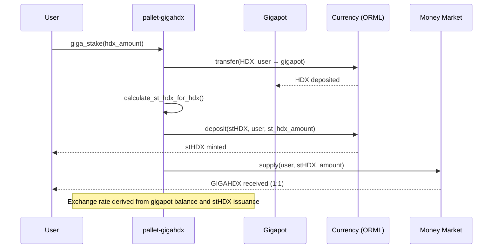
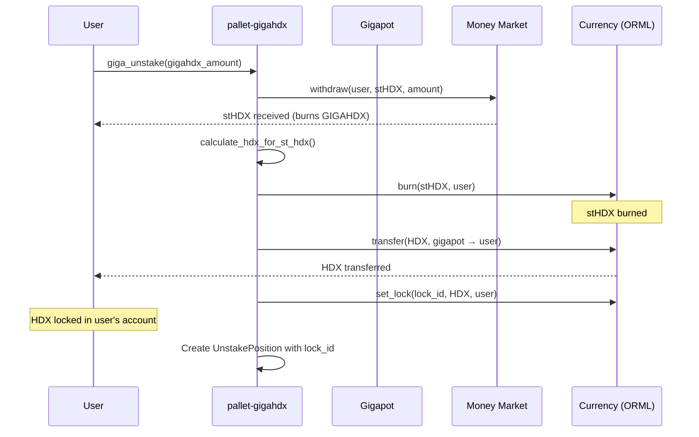
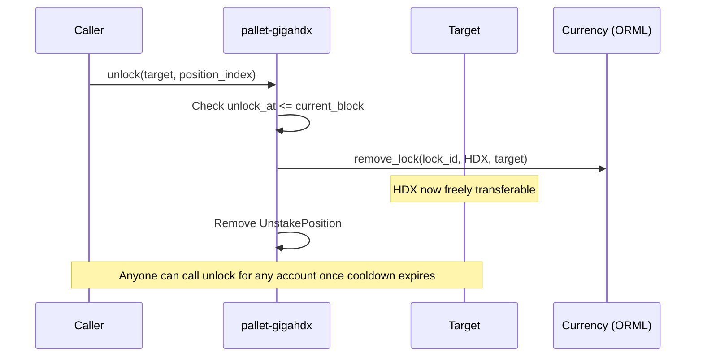
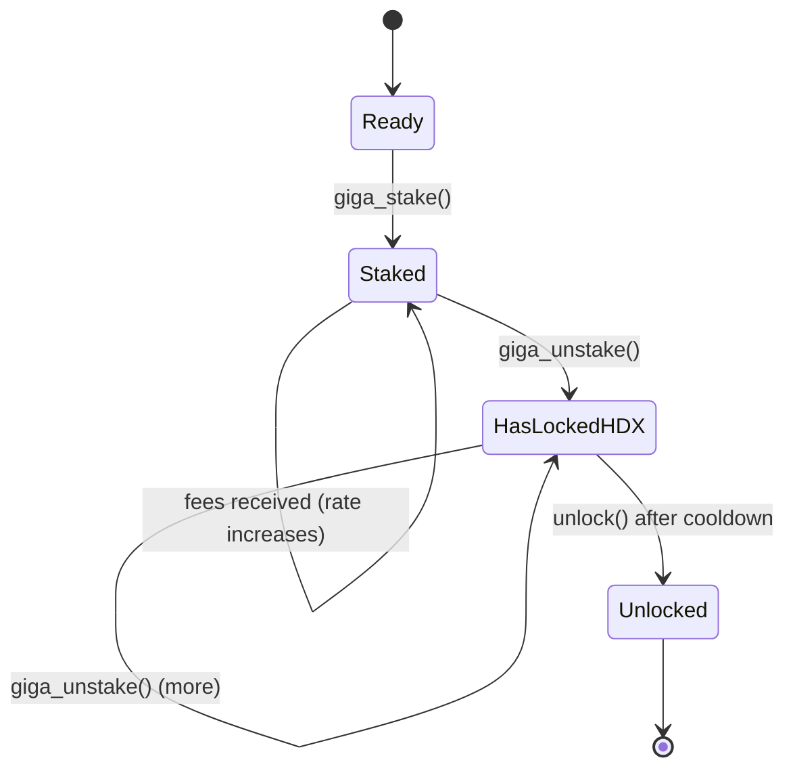

# pallet-gigahdx Specification

## 1. Overview

### Purpose

The GIGAHDX pallet implements a Liquid Staking Token (LST) for HDX with automatic value accrual:

1. **Giga-stake**: Convert HDX to GIGAHDX (via intermediate stHDX token)
2. **Giga-unstake**: Convert GIGAHDX back to HDX (locked in user's account with cooldown)
3. **Unlock**: Unlock HDX after cooldown expires

### Scope

This spec covers **core mechanics only**. Voting integration and referenda rewards are covered in a separate spec.

### Token Architecture

| Token | Description | Implementation |
|-------|-------------|----------------|
| HDX | Native token | Existing |
| stHDX | Intermediate vault token (appreciates) | Standard Substrate asset, pallet mints/burns |
| GIGAHDX | Money Market aToken (1:1 with stHDX) | AAVE aToken, received when supplying stHDX |

**Key insight**: stHDX and GIGAHDX are 1:1 interchangeable. Value accrual happens in stHDX (backed by growing HDX in gigapot). GIGAHDX is just the Money Market representation.

### Value Accrual

```
Exchange rate = Total HDX in gigapot / Total stHDX supply

At launch: 1 HDX = 1 stHDX
As fees accrue: 1 stHDX > 1 HDX (stHDX appreciates)
```

### Dependencies

- `pallet-fee-processor`: Sends trading fees to gigapot via FeeReceiver trait
- Money Market (AAVE): For supplying stHDX and receiving GIGAHDX
- `pallet-gigahdx-voting` (spec 03): Via `GigaHdxHooks` trait for vote checking during unstake

**Note:** `pallet-gigahdx-voting` has a direct dependency on this pallet (for `stake_rewards` and `gigapot_account_id`). This pallet only depends on the voting pallet via the loosely-coupled `GigaHdxHooks` trait.

---

## 2. Configuration

```rust
#[pallet::config]
pub trait Config: frame_system::Config {
    /// The overarching event type.
    type RuntimeEvent: From<Event<Self>> + IsType<<Self as frame_system::Config>::RuntimeEvent>;

    /// Asset ID type.
    type AssetId: Member + Parameter + Copy + MaxEncodedLen;

    /// Multi-asset currency supporting transfers, inspection, minting/burning, and locking.
    /// Used for HDX, stHDX, and GIGAHDX operations.
    /// MultiLockableCurrency needed to support multiple concurrent unlock positions.
    type Currency: Mutate<Self::AccountId, AssetId = Self::AssetId, Balance = Balance>
        + Inspect<Self::AccountId, AssetId = Self::AssetId, Balance = Balance>
        + MultiLockableCurrency<Self::AccountId, CurrencyId = Self::AssetId, Balance = Balance>;

    /// Money Market integration for supply/withdraw operations.
    type MoneyMarket: MoneyMarketOperations<Self::AccountId, Self::AssetId, Balance>;

    /// Native asset ID (HDX).
    #[pallet::constant]
    type HdxAssetId: Get<Self::AssetId>;

    /// stHDX asset ID - the intermediate staking token.
    #[pallet::constant]
    type StHdxAssetId: Get<Self::AssetId>;

    /// GIGAHDX asset ID - the Money Market aToken.
    #[pallet::constant]
    type GigaHdxAssetId: Get<Self::AssetId>;

    /// Pallet ID for the gigapot account.
    #[pallet::constant]
    type PalletId: Get<PalletId>;

    /// Cooldown period in blocks after giga-unstake (~222 days).
    #[pallet::constant]
    type CooldownPeriod: Get<BlockNumberFor<Self>>;

    /// Minimum HDX to stake.
    #[pallet::constant]
    type MinStake: Get<Balance>;

    /// Maximum unstake positions per account.
    #[pallet::constant]
    type MaxUnstakePositions: Get<u32>;

    /// Hooks for stake/unstake lifecycle events.
    /// Implemented by pallet-gigahdx-voting for vote tracking and rewards.
    type Hooks: GigaHdxHooks<Self::AccountId, Balance, BlockNumberFor<Self>>;

    /// Weight information.
    type WeightInfo: WeightInfo;
}
```

### Constants

| Constant | Type | Description | Suggested Value |
|----------|------|-------------|-----------------|
| `PalletId` | `PalletId` | Gigapot account identifier | `*b"gigahdx!"` |
| `HdxAssetId` | `AssetId` | Native HDX | `0` |
| `StHdxAssetId` | `AssetId` | Intermediate staking token | TBD |
| `GigaHdxAssetId` | `AssetId` | Money Market aToken | TBD |
| `CooldownPeriod` | `BlockNumber` | Unstake cooldown | `222 * DAYS` (~222 days) |
| `MinStake` | `Balance` | Minimum HDX to stake | `1_000_000_000_000` (1 HDX) |
| `MaxUnstakePositions` | `u32` | Max unstake positions per account | `10` |

---

## 3. Storage Schema

```rust
/// Unstake positions per account (pending HDX claims after cooldown).
#[pallet::storage]
#[pallet::getter(fn unstake_positions)]
pub type UnstakePositions<T: Config> = StorageMap<
    _,
    Blake2_128Concat,
    T::AccountId,
    BoundedVec<UnstakePosition<BlockNumberFor<T>>, T::MaxUnstakePositions>,
    ValueQuery,
>;
```

---

## 4. Types and Data Structures

### UnstakePosition

```rust
/// A unstake position after giga-unstake.
#[derive(Clone, Encode, Decode, Eq, PartialEq, RuntimeDebug, MaxEncodedLen, TypeInfo)]
pub struct UnstakePosition<BlockNumber> {
    /// Lock identifier for this position (used to identify the HDX lock in gigapot).
    pub lock_id: LockIdentifier,
    /// HDX amount to be unlocked.
    pub amount: Balance,
    /// Block number when cooldown expires and HDX can be claimed.
    pub unlock_at: BlockNumber,
}
```

### MoneyMarketOperations Trait

```rust
/// Trait for Money Market supply/withdraw operations.
pub trait MoneyMarketOperations<AccountId, AssetId, Balance> {
    type Error;

    /// Supply underlying asset to Money Market, receive aToken.
    /// For gigahdx: supply stHDX -> receive GIGAHDX (1:1).
    fn supply(
        who: &AccountId,
        underlying_asset: AssetId,
        amount: Balance,
    ) -> Result<Balance, Self::Error>;

    /// Withdraw from Money Market, burn aToken, receive underlying.
    /// For gigahdx: burn GIGAHDX -> receive stHDX (1:1).
    fn withdraw(
        who: &AccountId,
        underlying_asset: AssetId,
        amount: Balance,
    ) -> Result<Balance, Self::Error>;
}
```

---

## 5. Functions

### 5.1 `giga_stake` (Extrinsic)

Stake HDX to receive GIGAHDX.

**Flow**: HDX → stHDX (minted) → supply to MM → GIGAHDX

```rust
#[pallet::call_index(0)]
#[pallet::weight(T::WeightInfo::giga_stake())]
pub fn giga_stake(origin: OriginFor<T>, hdx_amount: Balance) -> DispatchResult {
    let who = ensure_signed(origin)?;

    ensure!(!hdx_amount.is_zero(), Error::<T>::ZeroAmount);
    ensure!(hdx_amount >= T::MinStake::get(), Error::<T>::InsufficientStake);

    // 1. Calculate stHDX to mint based on current exchange rate
    let st_hdx_amount = Self::calculate_st_hdx_for_hdx(hdx_amount)
        .ok_or(Error::<T>::Arithmetic)?;
    ensure!(!st_hdx_amount.is_zero(), Error::<T>::ZeroAmount);

    let gigapot = Self::gigapot_account_id();

    // 2. Transfer HDX from user to gigapot
    T::Currency::transfer(
        T::HdxAssetId::get(),
        &who,
        &gigapot,
        hdx_amount,
        Preservation::Expendable,
    )?;

    // 3. Mint stHDX to user
    T::Currency::mint_into(T::StHdxAssetId::get(), &who, st_hdx_amount)?;

    // 4. Supply stHDX to Money Market -> user receives GIGAHDX
    let gigahdx_received = T::MoneyMarket::supply(
        &who,
        T::StHdxAssetId::get(),
        st_hdx_amount,
    )?;

    // 5. Notify hooks
    T::Hooks::on_stake(&who, hdx_amount, gigahdx_received)?;

    Self::deposit_event(Event::Staked {
        who,
        hdx_amount,
        st_hdx_minted: st_hdx_amount,
        gigahdx_received,
        exchange_rate: Self::exchange_rate(),
    });

    Ok(())
}
```

### 5.2 `giga_unstake` (Extrinsic)

Unstake GIGAHDX to receive HDX (locked in user's account until cooldown expires).

**Flow**: Check can_unstake → Get additional_unstake_lock → Notify on_unstake → Withdraw from MM → stHDX → burn → transfer HDX to user → lock HDX with dynamic cooldown

```rust
#[pallet::call_index(1)]
#[pallet::weight(T::WeightInfo::giga_unstake())]
pub fn giga_unstake(origin: OriginFor<T>, gigahdx_amount: Balance) -> DispatchResult {
    let who = ensure_signed(origin)?;

    ensure!(!gigahdx_amount.is_zero(), Error::<T>::ZeroAmount);

    // 1. Check for votes in ongoing referenda - block if any exist
    ensure!(
        T::Hooks::can_unstake(&who),
        Error::<T>::ActiveVotesInOngoingReferenda
    );

    // 2. Get additional lock period from voting locks (before on_unstake clears them)
    let voting_lock = T::Hooks::additional_unstake_lock(&who);

    // 3. Notify hooks - handles force removal of finished votes, records rewards
    T::Hooks::on_unstake(&who, gigahdx_amount)?;

    // 4. Withdraw GIGAHDX from Money Market -> receive stHDX
    let st_hdx_withdrawn = T::MoneyMarket::withdraw(
        &who,
        T::StHdxAssetId::get(),
        gigahdx_amount,
    )?;

    // 5. Calculate HDX amount based on current exchange rate
    let hdx_amount = Self::calculate_hdx_for_st_hdx(st_hdx_withdrawn)
        .ok_or(Error::<T>::Arithmetic)?;
    ensure!(!hdx_amount.is_zero(), Error::<T>::ZeroAmount);

    // 6. Burn stHDX from user
    T::Currency::burn_from(
        T::StHdxAssetId::get(),
        &who,
        st_hdx_withdrawn,
        Precision::Exact,
        Fortitude::Polite,
    )?;

    // 7. Transfer HDX from gigapot to user
    let gigapot = Self::gigapot_account_id();
    T::Currency::transfer(
        T::HdxAssetId::get(),
        &gigapot,
        &who,
        hdx_amount,
        Preservation::Preserve,
    )?;

    // 8. Calculate dynamic cooldown: max(base_cooldown, voting_lock)
    let current_block = frame_system::Pallet::<T>::block_number();
    let actual_cooldown = T::CooldownPeriod::get().max(voting_lock);
    let unlock_at = current_block
        .checked_add(&actual_cooldown)
        .ok_or(Error::<T>::Arithmetic)?;

    UnstakePositions::<T>::try_mutate(&who, |positions| -> DispatchResult {
        // Generate lock_id from pallet prefix + current positions count
        let lock_id = Self::generate_lock_id(positions.len() as u32);

        // Lock HDX in user's account for this position
        T::Currency::set_lock(
            lock_id,
            T::HdxAssetId::get(),
            &who,
            hdx_amount,
        )?;

        let position = UnstakePosition {
            lock_id,
            amount: hdx_amount,
            unlock_at,
        };

        positions
            .try_push(position)
            .map_err(|_| Error::<T>::TooManyUnstakePositions)?;
        Ok(())
    })?;

    Self::deposit_event(Event::Unstaked {
        who,
        gigahdx_withdrawn: gigahdx_amount,
        st_hdx_burned: st_hdx_withdrawn,
        hdx_amount,
        unlock_at,
    });

    Ok(())
}
```

### 5.3 `unlock` (Extrinsic)

Unlock HDX after cooldown period expires. Can be called by anyone to unlock any account's expired position.

```rust
#[pallet::call_index(2)]
#[pallet::weight(T::WeightInfo::unlock())]
pub fn unlock(
    origin: OriginFor<T>,
    target: T::AccountId,
    position_index: u32,
) -> DispatchResult {
    ensure_signed(origin)?;

    let current_block = frame_system::Pallet::<T>::block_number();

    UnstakePositions::<T>::try_mutate(&target, |positions| -> DispatchResult {
        // Get the unstake position by index
        let position = positions
            .get(position_index as usize)
            .ok_or(Error::<T>::PositionNotFound)?;

        // Check cooldown has expired
        ensure!(
            current_block >= position.unlock_at,
            Error::<T>::CooldownNotExpired
        );

        let hdx_amount = position.amount;
        let lock_id = position.lock_id;

        // 1. Remove the lock on target's HDX
        T::Currency::remove_lock(
            lock_id,
            T::HdxAssetId::get(),
            &target,
        )?;

        // 2. Remove the unstake position
        positions.remove(position_index as usize);

        Self::deposit_event(Event::Unlocked {
            who: target.clone(),
            lock_id,
            hdx_amount,
        });

        Ok(())
    })
}
```

### 5.4 Helper Functions

```rust
impl<T: Config> Pallet<T> {
    /// Gigapot account holding HDX backing stHDX.
    pub fn gigapot_account_id() -> T::AccountId {
        T::PalletId::get().into_account_truncating()
    }

    /// Get total HDX in gigapot (from account balance).
    pub fn total_hdx() -> Balance {
        T::Currency::balance(T::HdxAssetId::get(), &Self::gigapot_account_id())
    }

    /// Get total stHDX supply (from asset total issuance).
    pub fn total_st_hdx_supply() -> Balance {
        T::Currency::total_issuance(T::StHdxAssetId::get())
    }

    /// Calculate exchange rate: HDX per stHDX.
    /// Derived from gigapot balance and stHDX total issuance.
    pub fn exchange_rate() -> FixedU128 {
        let total_st_hdx = Self::total_st_hdx_supply();
        if total_st_hdx.is_zero() {
            FixedU128::one() // Initial 1:1 rate
        } else {
            FixedU128::checked_from_rational(
                Self::total_hdx(),
                total_st_hdx,
            ).unwrap_or(FixedU128::one())
        }
    }

    /// Calculate stHDX to mint for given HDX amount.
    /// Formula: st_hdx = hdx_amount * total_st_hdx / total_hdx
    fn calculate_st_hdx_for_hdx(hdx_amount: Balance) -> Option<Balance> {
        let total_st_hdx = Self::total_st_hdx_supply();
        let total_hdx = Self::total_hdx();

        if total_st_hdx.is_zero() {
            Some(hdx_amount) // Initial 1:1
        } else {
            multiply_by_rational_with_rounding(
                hdx_amount,
                total_st_hdx,
                total_hdx,
                Rounding::Down,
            )
        }
    }

    /// Calculate HDX to return for given stHDX amount.
    /// Formula: hdx = st_hdx_amount * total_hdx / total_st_hdx
    fn calculate_hdx_for_st_hdx(st_hdx_amount: Balance) -> Option<Balance> {
        let total_st_hdx = Self::total_st_hdx_supply();
        if total_st_hdx.is_zero() {
            return None;
        }
        multiply_by_rational_with_rounding(
            st_hdx_amount,
            Self::total_hdx(),
            total_st_hdx,
            Rounding::Down,
        )
    }

    /// Generate lock identifier for an unstake position.
    /// Combines pallet prefix with position index to create unique 8-byte lock ID.
    fn generate_lock_id(position_index: u32) -> LockIdentifier {
        let mut id = *b"gigahdx_";
        // Encode position_index into last 4 bytes
        let bytes = position_index.to_le_bytes();
        id[4] = bytes[0];
        id[5] = bytes[1];
        id[6] = bytes[2];
        id[7] = bytes[3];
        id
    }
}
```

---

## 6. Events

```rust
#[pallet::event]
#[pallet::generate_deposit(pub(super) fn deposit_event)]
pub enum Event<T: Config> {
    /// HDX staked, GIGAHDX received.
    Staked {
        who: T::AccountId,
        hdx_amount: Balance,
        st_hdx_minted: Balance,
        gigahdx_received: Balance,
        exchange_rate: FixedU128,
    },

    /// Giga-unstake initiated, unstake position created.
    Unstaked {
        who: T::AccountId,
        gigahdx_withdrawn: Balance,
        st_hdx_burned: Balance,
        hdx_amount: Balance,
        unlock_at: BlockNumberFor<T>,
    },

    /// HDX unlocked after cooldown expired.
    Unlocked {
        who: T::AccountId,
        lock_id: LockIdentifier,
        hdx_amount: Balance,
    },

    /// Fees received, exchange rate increased.
    FeesReceived {
        amount: Balance,
        new_exchange_rate: FixedU128,
    },

    /// Reward converted from HDX to GIGAHDX (via pallet-gigahdx-voting).
    RewardStaked {
        who: T::AccountId,
        hdx_amount: Balance,
        gigahdx_received: Balance,
    },
}
```

---

## 7. Errors

```rust
#[pallet::error]
pub enum Error<T> {
    /// Zero amount not allowed.
    ZeroAmount,

    /// Stake amount below minimum.
    InsufficientStake,

    /// Arithmetic overflow/underflow.
    Arithmetic,

    /// Unstake position not found.
    PositionNotFound,

    /// Cooldown period has not expired.
    CooldownNotExpired,

    /// Too many unstake positions for account.
    TooManyUnstakePositions,

    /// Money Market operation failed.
    MoneyMarketError,

    /// Cannot unstake while votes exist in ongoing referenda.
    /// User must wait for referenda to finish or remove votes manually.
    ActiveVotesInOngoingReferenda,
}
```

---

## 8. Fee Processor Integration

### FeeReceiver Implementation

The gigahdx pallet receives trading fees via the FeeReceiver trait (from pallet-fee-processor).

```rust
/// GigaHdx fee receiver - fees increase exchange rate.
pub struct GigaHdxFeeReceiver<T>(PhantomData<T>);

impl<T: Config> FeeReceiver<T::AccountId, Balance> for GigaHdxFeeReceiver<T> {
    type Error = DispatchError;

    fn destination() -> T::AccountId {
        Pallet::<T>::gigapot_account_id()
    }

    fn percentage() -> Permill {
        // ~50% as per gigahdx.spec (configurable via runtime)
        Permill::from_percent(50)
    }

    fn destinations() -> Vec<(T::AccountId, Permill)> {
        vec![(Self::destination(), Self::percentage())]
    }

    fn on_fee_received(
        _trader: Option<T::AccountId>,
        amount: Balance,
    ) -> Result<(), Self::Error> {
        // HDX is transferred to gigapot by fee-processor.
        // No state update needed - exchange rate is derived from:
        // - gigapot HDX balance (automatically increased by the transfer)
        // - stHDX total issuance (unchanged)

        let new_rate = Pallet::<T>::exchange_rate();

        Pallet::<T>::deposit_event(Event::FeesReceived {
            amount,
            new_exchange_rate: new_rate,
        });

        Ok(())
    }
}
```

### Runtime Configuration

```rust
// In fee-processor config
type FeeReceivers = (
    StakingFeeReceiver<Runtime>,      // Legacy staking ~20%
    GigaHdxFeeReceiver<Runtime>,      // GigaHDX pot ~50%
    // Future: GigaRewardFeeReceiver  // Voting rewards ~30%
);
```

---

## 9. Money Market Integration

### AaveMoneyMarket Implementation

Wraps existing AAVE trade executor patterns for supply/withdraw.

```rust
/// Money Market adapter using AAVE.
pub struct AaveMoneyMarket<T>(PhantomData<T>);

impl<T: Config + pallet_evm_accounts::Config>
    MoneyMarketOperations<T::AccountId, T::AssetId, Balance>
    for AaveMoneyMarket<T>
{
    type Error = DispatchError;

    fn supply(
        who: &T::AccountId,
        underlying_asset: T::AssetId,
        amount: Balance,
    ) -> Result<Balance, Self::Error> {
        // 1. Ensure EVM address is bound
        ensure!(
            pallet_evm_accounts::Pallet::<T>::bound_account_id(
                pallet_evm_accounts::Pallet::<T>::evm_address(who)
            ).is_some(),
            Error::<T>::MoneyMarketError
        );

        // 2. Call AAVE pool supply via EVM
        // Uses existing AaveTradeExecutor::do_supply_on_behalf_of pattern
        // from runtime/hydradx/src/evm/aave_trade_executor.rs

        // 3. Return aToken amount (1:1 minus small rounding buffer)
        Ok(amount.saturating_sub(2))
    }

    fn withdraw(
        who: &T::AccountId,
        underlying_asset: T::AssetId,
        amount: Balance,
    ) -> Result<Balance, Self::Error> {
        // 1. Call AAVE pool withdraw via EVM
        // Uses existing AaveTradeExecutor::do_withdraw pattern

        // 2. Return underlying amount (1:1)
        Ok(amount)
    }
}
```

---

## 10. Public Functions for pallet-gigahdx-voting

These public functions are called directly by `pallet-gigahdx-voting` when claiming rewards.

```rust
impl<T: Config> Pallet<T> {
    /// Convert HDX to GIGAHDX for reward claiming.
    /// Called by pallet-gigahdx-voting during claim_rewards.
    /// HDX should already be in the gigapot (transferred by voting pallet).
    pub fn stake_rewards(who: &T::AccountId, hdx_amount: Balance) -> Result<Balance, DispatchError> {
        // 1. Calculate stHDX to mint based on current exchange rate
        let st_hdx_amount = Self::calculate_st_hdx_for_hdx(hdx_amount)
            .ok_or(Error::<T>::Arithmetic)?;

        // 2. Mint stHDX to user
        T::Currency::mint_into(T::StHdxAssetId::get(), who, st_hdx_amount)?;

        // 3. Supply stHDX to Money Market -> user receives GIGAHDX
        let gigahdx_received = T::MoneyMarket::supply(
            who,
            T::StHdxAssetId::get(),
            st_hdx_amount,
        )?;

        Self::deposit_event(Event::RewardStaked {
            who: who.clone(),
            hdx_amount,
            gigahdx_received,
        });

        Ok(gigahdx_received)
    }

    /// Get the gigapot account ID.
    /// Public for pallet-gigahdx-voting to transfer rewards.
    pub fn gigapot_account_id() -> T::AccountId {
        T::PalletId::get().into_account_truncating()
    }
}
```

---

## 11. Runtime Configuration

```rust
parameter_types! {
    pub const GigaHdxPalletId: PalletId = PalletId(*b"gigahdx!");
    pub const CooldownPeriod: BlockNumber = 222 * DAYS;
    pub const MinGigaStake: Balance = 1_000_000_000_000; // 1 HDX
    pub const MaxUnstakePositions: u32 = 10;
    pub const StHdxAssetId: AssetId = 100; // TBD - register in asset registry
    pub const GigaHdxAssetId: AssetId = 101; // TBD - AAVE aToken
}

impl pallet_gigahdx::Config for Runtime {
    type RuntimeEvent = RuntimeEvent;
    type AssetId = AssetId;
    type Currency = Currencies;  // Unified: HDX, stHDX, GIGAHDX
    type MoneyMarket = AaveMoneyMarket<Runtime>;
    type HdxAssetId = NativeAssetId;
    type StHdxAssetId = StHdxAssetId;
    type GigaHdxAssetId = GigaHdxAssetId;
    type PalletId = GigaHdxPalletId;
    type CooldownPeriod = CooldownPeriod;
    type MinStake = MinGigaStake;
    type MaxUnstakePositions = MaxUnstakePositions;
    type WeightInfo = weights::pallet_gigahdx::HydraWeight<Runtime>;
}
```

---

## 12. Security Considerations

### Arithmetic Safety
- All balance operations use `checked_add`, `checked_sub`, `saturating_*`
- Exchange rate calculation guards against division by zero

### Exchange Rate Manipulation
- Exchange rate only increases through fee accumulation (controlled by fee-processor)
- No way to artificially inflate rate without real HDX backing

### Cooldown Period
- Long cooldown (~222 days) prevents short-term manipulation
- Ensures governance lock periods are always respected

### Money Market Integration
- Supply/withdraw through established AAVE patterns
- Locked GIGAHDX handling deferred to voting spec

---

## 13. Test Scenarios

### Unit Tests

1. **giga_stake**
   - Success: HDX transferred, stHDX minted, GIGAHDX received
   - Fail if amount < min stake
   - Exchange rate calculation correct
   - **Exchange rate unchanged after stake** (HDX and stHDX increase proportionally)

2. **giga_unstake**
   - Success: HDX transferred to user and locked, unstake position created
   - HDX locked in user's account with generated lock_id
   - lock_id correctly derived from pallet prefix + positions list length
   - Fail if too many unstake positions
   - Exchange rate applied correctly
   - **Exchange rate unchanged after unstake** (HDX and stHDX decrease proportionally)

3. **unlock**
   - Success after cooldown: lock removed from target's HDX
   - Can be called by anyone (not just the target account)
   - Fail if cooldown (unlock_at) not reached
   - Fail if position_index out of bounds

4. **Exchange rate**
   - Initial rate is 1:1 (when stHDX supply is 0)
   - Rate unchanged by giga_stake/giga_unstake (proportional changes)
   - Rate increases only when fees added to gigapot (HDX increases, stHDX unchanged)
   - After rate increase: new stakers get fewer stHDX per HDX

### Integration Tests

1. **Full flow**: giga_stake → wait → giga_unstake (HDX transferred & locked) → wait until unlock_at → unlock(target, position_index)
2. **Fee accrual**: giga_stake → fees received → exchange rate increases → giga_unstake (get more HDX)
3. **Multiple positions**: giga_unstake multiple times → each gets unique lock_id → unlock in any order
4. **Third-party unlock**: User A unstakes → cooldown expires → User B calls unlock(A, index) → A's HDX unlocked

---

## 14. Mermaid Diagrams

### Giga-stake Flow



### Giga-unstake Flow



### Unlock Flow



### State Machine



---

## Appendix: File Structure

```
pallets/gigahdx/
├── Cargo.toml
├── src/
│   ├── lib.rs           # Main pallet logic
│   ├── types.rs         # UnstakePosition
│   ├── traits.rs        # MoneyMarketOperations, LegacyStakingAccess
│   ├── weights.rs       # Weight definitions
│   ├── benchmarking.rs  # Benchmarks
│   └── tests/
│       ├── mod.rs
│       ├── mock.rs
│       ├── stake.rs
│       ├── unstake.rs
│       └── unlock.rs
```
