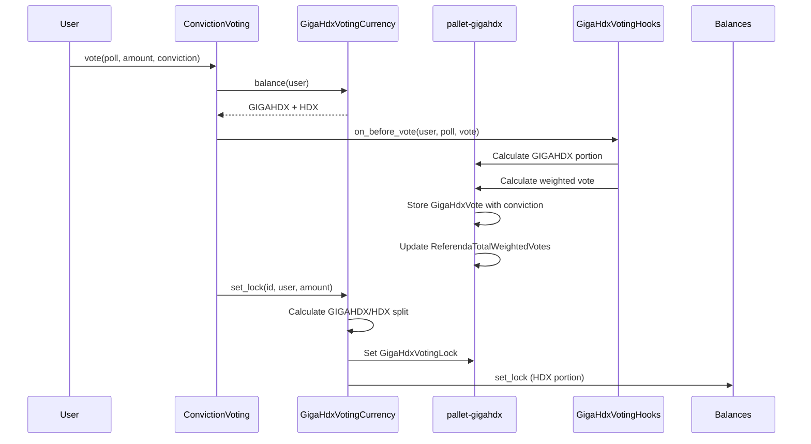
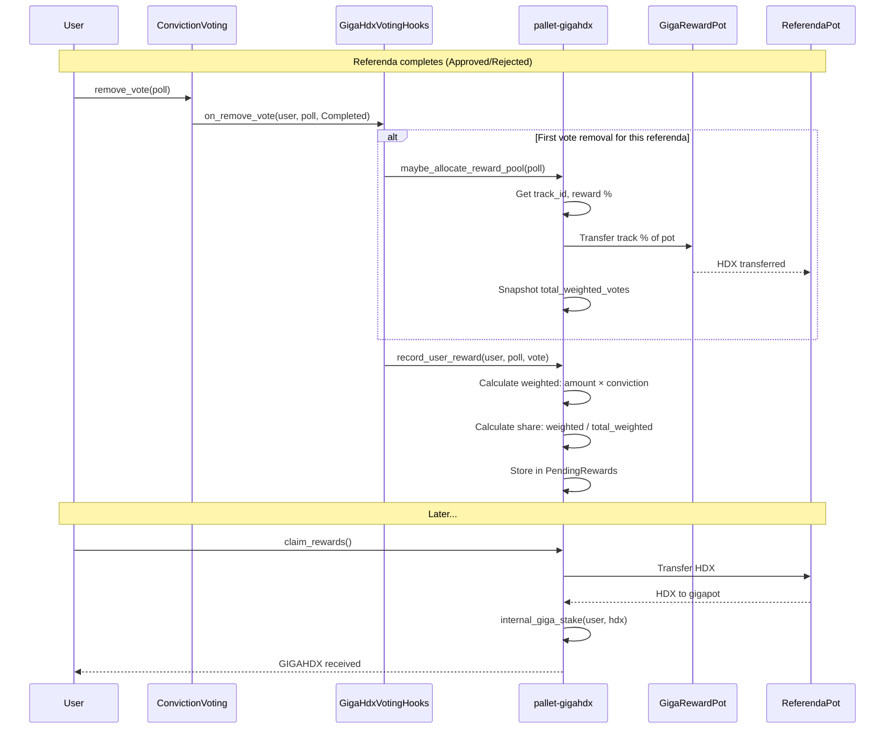
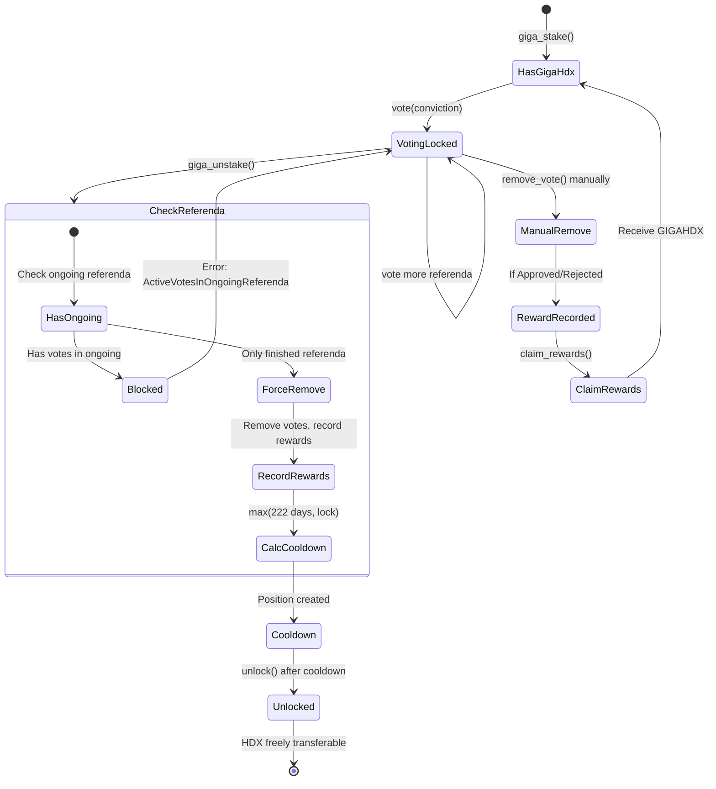

# pallet-gigahdx-voting Specification

## 1. Overview

### Purpose

`pallet-gigahdx-voting` is a **separate pallet** that handles GIGAHDX voting integration and referenda participation rewards:

1. **Custom Voting Adapter**: Implement traits required by `pallet-conviction-voting` to support voting with combined GIGAHDX + HDX balance
2. **GIGAHDX Token Locking**: Substrate-side lock storage for governance voting (read by EVM via precompile)
3. **Vote Tracking**: Record GIGAHDX votes per referenda for reward eligibility
4. **Referenda Rewards**: Lazy allocation and conviction-weighted distribution of rewards
5. **Unstake Query Interface**: Provide `can_unstake` and `additional_lock` for pallet-gigahdx

### Architecture

```
┌─────────────────────────┐      ┌─────────────────────────────┐
│    pallet-gigahdx       │      │   pallet-gigahdx-voting    │
│                         │      │                             │
│  - giga_stake           │      │  - Vote tracking            │
│  - giga_unstake ────────┼──────┼─▶ can_unstake()            │
│  - unlock               │      │  - additional_unstake_lock()|
│                         │      │  - claim_rewards            │
│                         │      │  - VotingHooks impl         │
│                         │      │  - Currency adapter         │
└─────────────────────────┘      └─────────────────────────────┘
         │                                    │
         │                                    │
         ▼                                    ▼
┌─────────────────────────────────────────────────────────────┐
│                  pallet-conviction-voting                    │
└─────────────────────────────────────────────────────────────┘
```

### Scope

This spec covers `pallet-gigahdx-voting` only. It does NOT modify `pallet-conviction-voting` - instead, it provides a custom Currency adapter and VotingHooks implementation.

**Related Specs:**
- `01-pallet-fee-processor.md` - Fee distribution to GigaReward pot
- `02-pallet-gigahdx.md` - Core staking mechanics (uses interface from this pallet)
- `04-gigahdx-atoken.md` (separate) - EVM aToken contract with locking

### Key Design Decisions

| Decision | Rationale |
|----------|-----------|
| Separate pallet | Clean separation: voting pallet knows nothing about staking mechanics |
| Hooks pattern | pallet-gigahdx calls this pallet via `GigaHdxHooks` trait for lifecycle events |
| Full conviction support | Users can choose conviction level, higher conviction = higher rewards |
| Combined balance adapter | Allows users to vote with both GIGAHDX and HDX seamlessly |
| GIGAHDX-first lock priority | Incentivizes governance participation from GIGAHDX holders |
| Lazy reward allocation | Avoids creating temporary pots during active referenda |
| Per-track reward percentages | Different governance tracks can have different reward allocations |
| Conviction-weighted rewards | Rewards proportional to `amount × conviction_multiplier` |

### Dependencies

- `pallet-gigahdx` (spec 02) - **Direct dependency** for `stake_rewards()` and `gigapot_account_id()`
- `pallet-fee-processor` (spec 01) - Fee distribution to GigaReward pot
- `pallet-conviction-voting` - Substrate conviction voting (unmodified)
- `pallet-referenda` - Referenda management and status queries

**Dependency Pattern:**
- `pallet-gigahdx-voting` → `pallet-gigahdx` (direct, tight coupling for reward staking)
- `pallet-gigahdx` → `pallet-gigahdx-voting` (via `GigaHdxHooks` trait, loose coupling)

---

## 2. Interface Traits

### 2.1 GigaHdxHooks (pallet-gigahdx-voting → pallet-gigahdx)

The `pallet-gigahdx` pallet uses this hooks interface for stake/unstake lifecycle events. Implemented by `pallet-gigahdx-voting`.

```rust
/// Hooks trait for pallet-gigahdx stake/unstake lifecycle.
/// Implemented by pallet-gigahdx-voting.
pub trait GigaHdxHooks<AccountId, Balance, BlockNumber> {
    /// Called after a successful giga_stake.
    /// Can be used to track staking for analytics or other purposes.
    fn on_stake(
        who: &AccountId,
        hdx_amount: Balance,
        gigahdx_received: Balance,
    ) -> DispatchResult;

    /// Called during giga_unstake after can_unstake check passes.
    /// Handles force removal of votes from finished referenda and records rewards.
    fn on_unstake(who: &AccountId, gigahdx_amount: Balance) -> DispatchResult;

    /// Check if the user can unstake.
    /// Returns `false` if user has votes in any ongoing (not finished) referenda.
    /// Returns `true` if user has no votes or only votes in finished referenda.
    fn can_unstake(who: &AccountId) -> bool;

    /// Get the additional lock period required due to voting locks.
    /// Returns the maximum remaining lock duration across all votes.
    /// Called BEFORE on_unstake to capture lock periods before votes are removed.
    /// Used to calculate: actual_cooldown = max(base_cooldown, additional_unstake_lock)
    fn additional_unstake_lock(who: &AccountId) -> BlockNumber;
}
```

### 2.2 Direct Dependency on pallet-gigahdx

`pallet-gigahdx-voting` has a **direct dependency** on `pallet-gigahdx`. This allows the voting pallet to:
- Call `pallet_gigahdx::Pallet::<T>::stake_rewards()` for reward claiming
- Access `pallet_gigahdx::Pallet::<T>::gigapot_account_id()` for transfers

This avoids a circular trait dependency while keeping the hooks pattern for the reverse direction.

### 2.3 Referenda Traits

Traits for querying referendum state. Based on the existing `GetReferendumState` pattern from `pallet-staking`.

```rust
/// Referendum outcome for reward calculations.
#[derive(Clone, Copy, PartialEq, Eq, Debug)]
pub enum ReferendumOutcome {
    /// Referendum is still ongoing (voting active).
    Ongoing,
    /// Referendum was approved (passed).
    Approved,
    /// Referendum was rejected (failed).
    Rejected,
    /// Referendum was cancelled (no rewards).
    Cancelled,
}

/// Query referendum state/outcome.
/// Similar to pallet-staking's GetReferendumState but returns full outcome.
pub trait GetReferendumState<Index> {
    /// Check if referendum is finished (not ongoing).
    fn is_referendum_finished(index: Index) -> bool;

    /// Get the full referendum outcome.
    fn referendum_outcome(index: Index) -> ReferendumOutcome;
}

/// Query track ID for a referendum.
pub trait GetTrackId<Index> {
    /// Track ID type (typically u16).
    type TrackId;

    /// Get the track ID for a given referendum index.
    /// Returns None if referendum doesn't exist.
    fn track_id(index: Index) -> Option<Self::TrackId>;
}
```

**Implementation** (in runtime configuration):

```rust
// Implement for pallet_referenda
impl GetReferendumState<ReferendumIndex> for pallet_referenda::Pallet<Runtime> {
    fn is_referendum_finished(index: ReferendumIndex) -> bool {
        !matches!(Self::referendum_status(index), Some(ReferendumStatus::Ongoing { .. }))
    }

    fn referendum_outcome(index: ReferendumIndex) -> ReferendumOutcome {
        match Self::referendum_status(index) {
            Some(ReferendumStatus::Ongoing { .. }) => ReferendumOutcome::Ongoing,
            Some(ReferendumStatus::Approved { .. }) => ReferendumOutcome::Approved,
            Some(ReferendumStatus::Rejected { .. }) => ReferendumOutcome::Rejected,
            Some(ReferendumStatus::Cancelled { .. }) |
            Some(ReferendumStatus::TimedOut { .. }) |
            Some(ReferendumStatus::Killed { .. }) |
            None => ReferendumOutcome::Cancelled,
        }
    }
}

impl GetTrackId<ReferendumIndex> for pallet_referenda::Pallet<Runtime> {
    type TrackId = u16;

    fn track_id(index: ReferendumIndex) -> Option<Self::TrackId> {
        Self::referendum_info(index).map(|info| info.track)
    }
}
```

---

## 3. Configuration

`pallet-gigahdx-voting` configuration:

```rust
#[pallet::config]
pub trait Config: frame_system::Config + pallet_gigahdx::Config {
    /// The overarching event type.
    type RuntimeEvent: From<Event<Self>> + IsType<<Self as frame_system::Config>::RuntimeEvent>;

    /// GigaReward pot account for referenda rewards.
    #[pallet::constant]
    type GigaRewardPotId: Get<PalletId>;

    /// Per-track reward percentage configuration.
    type TrackRewardPercentages: TrackRewardConfig;

    /// Maximum votes a single account can have active.
    #[pallet::constant]
    type MaxVotes: Get<u32>;

    /// Vote locking period (base period, multiplied by conviction).
    #[pallet::constant]
    type VoteLockingPeriod: Get<BlockNumberFor<Self>>;

    /// Referenda state queries (status and track ID).
    type Referenda: GetReferendumState<ReferendumIndex> + GetTrackId<ReferendumIndex>;

    /// Weight information.
    type WeightInfo: WeightInfo;
}
```

### TrackRewardConfig Trait

```rust
/// Configuration for per-track reward percentages.
pub trait TrackRewardConfig {
    /// Get reward percentage for a specific track.
    fn reward_percentage(track_id: TrackId) -> Permill;
}

/// Example implementation with different percentages per track.
pub struct HydraTrackRewardConfig;

impl TrackRewardConfig for HydraTrackRewardConfig {
    fn reward_percentage(track_id: TrackId) -> Permill {
        match track_id {
            0 => Permill::from_percent(15),  // root - highest rewards
            5 => Permill::from_percent(12),  // treasurer
            9 => Permill::from_percent(12),  // economic_parameters
            4 => Permill::from_percent(10),  // general_admin
            8 => Permill::from_percent(10),  // omnipool_admin
            6 => Permill::from_percent(8),   // spender
            7 => Permill::from_percent(5),   // tipper - lowest rewards
            _ => Permill::from_percent(10),  // default
        }
    }
}
```

### Constants

| Constant | Type | Description | Suggested Value |
|----------|------|-------------|-----------------|
| `GigaRewardPotId` | `PalletId` | Reward pot account | `*b"gigarwrd"` |
| `MaxVotes` | `u32` | Max active votes per account | `25` |
| `BaseCooldownPeriod` | `BlockNumber` | Base cooldown (~222 days) | `222 * DAYS` |

---

## 4. Storage Schema

### Vote Tracking Storage

```rust
/// Track GIGAHDX votes per account per referenda.
/// Only tracks votes made with GIGAHDX (not HDX portion).
#[pallet::storage]
#[pallet::getter(fn gigahdx_votes)]
pub type GigaHdxVotes<T: Config> = StorageDoubleMap<
    _,
    Blake2_128Concat,
    T::AccountId,
    Blake2_128Concat,
    ReferendumIndex,
    GigaHdxVote<BlockNumberFor<T>>,
    OptionQuery,
>;

/// Aggregate conviction-weighted GIGAHDX votes per referenda (for reward calculation).
/// Stored as: sum of (amount × conviction_multiplier) for all voters.
#[pallet::storage]
#[pallet::getter(fn referenda_total_weighted_votes)]
pub type ReferendaTotalWeightedVotes<T: Config> = StorageMap<
    _,
    Blake2_128Concat,
    ReferendumIndex,
    Balance,
    ValueQuery,
>;

/// Active GIGAHDX lock amount per account (for voting).
/// This is the Substrate-side tracking of voting locks.
#[pallet::storage]
#[pallet::getter(fn gigahdx_voting_lock)]
pub type GigaHdxVotingLock<T: Config> = StorageMap<
    _,
    Blake2_128Concat,
    T::AccountId,
    Balance,
    ValueQuery,
>;

/// Split lock tracking: how much of a voting lock is GIGAHDX vs HDX.
/// Needed for extend_lock and remove_lock operations.
#[pallet::storage]
#[pallet::getter(fn lock_split)]
pub type LockSplit<T: Config> = StorageMap<
    _,
    Blake2_128Concat,
    T::AccountId,
    VotingLockSplit,
    ValueQuery,
>;
```

### Referenda Reward Storage

```rust
/// Referenda reward pool data (created on first vote removal after finish).
#[pallet::storage]
#[pallet::getter(fn referenda_reward_pool)]
pub type ReferendaRewardPool<T: Config> = StorageMap<
    _,
    Blake2_128Concat,
    ReferendumIndex,
    ReferendaReward<T::AccountId>,
    OptionQuery,
>;

/// Pending rewards claimable by users (recorded on vote removal).
#[pallet::storage]
#[pallet::getter(fn pending_rewards)]
pub type PendingRewards<T: Config> = StorageMap<
    _,
    Blake2_128Concat,
    T::AccountId,
    BoundedVec<PendingRewardEntry, T::MaxVotes>,
    ValueQuery,
>;

/// Tracks if a referenda's reward pool has been allocated.
#[pallet::storage]
#[pallet::getter(fn reward_allocated)]
pub type RewardAllocated<T: Config> = StorageMap<
    _,
    Blake2_128Concat,
    ReferendumIndex,
    bool,
    ValueQuery,
>;
```

---

## 5. Types and Data Structures

### GigaHdxVote

```rust
/// A GIGAHDX vote record for reward tracking.
#[derive(Clone, Encode, Decode, Eq, PartialEq, RuntimeDebug, MaxEncodedLen, TypeInfo)]
pub struct GigaHdxVote<BlockNumber> {
    /// Amount of GIGAHDX used in vote.
    pub amount: Balance,
    /// Conviction level chosen by user.
    pub conviction: Conviction,
    /// Block when vote was cast.
    pub voted_at: BlockNumber,
    /// Block when voting lock expires (based on conviction).
    pub lock_expires_at: BlockNumber,
}
```

### VotingLockSplit

```rust
/// Tracks how a voting lock is split between GIGAHDX and HDX.
#[derive(Clone, Encode, Decode, Eq, PartialEq, RuntimeDebug, MaxEncodedLen, TypeInfo, Default)]
pub struct VotingLockSplit {
    /// GIGAHDX portion of the lock.
    pub gigahdx_amount: Balance,
    /// HDX portion of the lock.
    pub hdx_amount: Balance,
}
```

### ReferendaReward

```rust
/// Referenda reward pool information.
#[derive(Clone, Encode, Decode, Eq, PartialEq, RuntimeDebug, MaxEncodedLen, TypeInfo)]
pub struct ReferendaReward<AccountId> {
    /// Track ID of the referenda.
    pub track_id: TrackId,
    /// Total HDX allocated to this referenda's reward pool.
    pub total_reward: Balance,
    /// Total conviction-weighted votes (snapshot at allocation time).
    pub total_weighted_votes: Balance,
    /// Remaining reward balance.
    pub remaining_reward: Balance,
    /// Reward pot account for this specific referenda.
    pub pot_account: AccountId,
}
```

### PendingRewardEntry

```rust
/// A pending reward entry for a user.
#[derive(Clone, Encode, Decode, Eq, PartialEq, RuntimeDebug, MaxEncodedLen, TypeInfo)]
pub struct PendingRewardEntry {
    /// Referenda ID.
    pub referenda_id: ReferendumIndex,
    /// Calculated reward amount (in HDX).
    pub reward_amount: Balance,
}
```

### Conviction Multipliers

```rust
/// Conviction multipliers for reward weighting.
/// These match the standard Substrate conviction voting multipliers.
impl Conviction {
    pub fn reward_multiplier(&self) -> FixedU128 {
        match self {
            Conviction::None => FixedU128::from_rational(1, 10),    // 0.1x
            Conviction::Locked1x => FixedU128::one(),               // 1x
            Conviction::Locked2x => FixedU128::from(2),             // 2x
            Conviction::Locked3x => FixedU128::from(3),             // 3x
            Conviction::Locked4x => FixedU128::from(4),             // 4x
            Conviction::Locked5x => FixedU128::from(5),             // 5x
            Conviction::Locked6x => FixedU128::from(6),             // 6x
        }
    }

    /// Lock period multiplier (in terms of VoteLockingPeriod).
    pub fn lock_period_multiplier(&self) -> u32 {
        match self {
            Conviction::None => 0,
            Conviction::Locked1x => 1,
            Conviction::Locked2x => 2,
            Conviction::Locked3x => 4,
            Conviction::Locked4x => 8,
            Conviction::Locked5x => 16,
            Conviction::Locked6x => 32,
        }
    }
}
```

---

## 6. Custom Voting Currency Adapter

### 6.1 Adapter Structure

The adapter wraps both GIGAHDX and HDX to present a unified currency interface to `pallet-conviction-voting`.

```rust
/// Combined GIGAHDX + HDX currency adapter for conviction voting.
pub struct GigaHdxVotingCurrency<T>(PhantomData<T>);
```

### 6.2 fungible::Inspect Implementation

```rust
impl<T: Config> fungible::Inspect<T::AccountId> for GigaHdxVotingCurrency<T> {
    type Balance = Balance;

    fn total_issuance() -> Balance {
        // Return combined issuance (for MaxTurnout calculation)
        let gigahdx_issuance = T::Currency::total_issuance(T::GigaHdxAssetId::get());
        let hdx_issuance = T::Currency::total_issuance(T::HdxAssetId::get());
        gigahdx_issuance.saturating_add(hdx_issuance)
    }

    fn balance(who: &T::AccountId) -> Balance {
        // Return combined balance: GIGAHDX + HDX
        let gigahdx = T::Currency::free_balance(T::GigaHdxAssetId::get(), who);
        let hdx = T::Currency::free_balance(T::HdxAssetId::get(), who);
        gigahdx.saturating_add(hdx)
    }

    fn reducible_balance(
        who: &T::AccountId,
        preservation: Preservation,
        force: Fortitude,
    ) -> Balance {
        let gigahdx_reducible = T::Currency::reducible_balance(
            T::GigaHdxAssetId::get(), who, preservation, force
        );
        let hdx_reducible = T::Currency::reducible_balance(
            T::HdxAssetId::get(), who, preservation, force
        );
        gigahdx_reducible.saturating_add(hdx_reducible)
    }

    fn can_deposit(
        who: &T::AccountId,
        amount: Balance,
        provenance: Provenance,
    ) -> DepositConsequence {
        // Delegate to HDX (rewards are paid in HDX then converted)
        T::Currency::can_deposit(T::HdxAssetId::get(), who, amount, provenance)
    }

    fn can_withdraw(
        who: &T::AccountId,
        amount: Balance,
    ) -> WithdrawConsequence<Balance> {
        let total = Self::balance(who);
        if amount > total {
            WithdrawConsequence::BalanceLow
        } else {
            WithdrawConsequence::Success
        }
    }
}
```

### 6.3 LockableCurrency Implementation

```rust
impl<T: Config> LockableCurrency<T::AccountId> for GigaHdxVotingCurrency<T> {
    type Moment = BlockNumberFor<T>;
    type MaxLocks = T::MaxLocks;

    /// Set a lock with GIGAHDX-first priority.
    fn set_lock(
        id: LockIdentifier,
        who: &T::AccountId,
        amount: Balance,
        reasons: WithdrawReasons,
    ) {
        let gigahdx_balance = T::Currency::free_balance(T::GigaHdxAssetId::get(), who);

        // Calculate split: GIGAHDX first, then HDX
        let (gigahdx_lock, hdx_lock) = if amount <= gigahdx_balance {
            (amount, Balance::zero())
        } else {
            (gigahdx_balance, amount.saturating_sub(gigahdx_balance))
        };

        // Store split for extend/remove operations
        LockSplit::<T>::insert(who, VotingLockSplit {
            gigahdx_amount: gigahdx_lock,
            hdx_amount: hdx_lock,
        });

        // Apply GIGAHDX lock (Substrate-side tracking)
        // The LockableAToken contract reads this storage via the LockManager precompile
        if !gigahdx_lock.is_zero() {
            GigaHdxVotingLock::<T>::insert(who, gigahdx_lock);
        }

        // Apply HDX lock via standard mechanism
        if !hdx_lock.is_zero() {
            T::NativeCurrency::set_lock(id, who, hdx_lock, reasons);
        }
    }

    /// Extend an existing lock.
    fn extend_lock(
        id: LockIdentifier,
        who: &T::AccountId,
        amount: Balance,
        reasons: WithdrawReasons,
    ) {
        let current_split = LockSplit::<T>::get(who);
        let current_total = current_split.gigahdx_amount
            .saturating_add(current_split.hdx_amount);

        if amount > current_total {
            // Need to lock more - recalculate split
            Self::set_lock(id, who, amount, reasons);
        }
        // If amount <= current, lock already sufficient
    }

    /// Remove a lock.
    fn remove_lock(id: LockIdentifier, who: &T::AccountId) {
        let split = LockSplit::<T>::take(who);

        // Remove GIGAHDX lock (precompile will read updated storage)
        if !split.gigahdx_amount.is_zero() {
            GigaHdxVotingLock::<T>::remove(who);
        }

        // Remove HDX lock
        if !split.hdx_amount.is_zero() {
            T::NativeCurrency::remove_lock(id, who);
        }
    }
}
```

### 6.4 ReservableCurrency Implementation

```rust
impl<T: Config> ReservableCurrency<T::AccountId> for GigaHdxVotingCurrency<T> {
    fn can_reserve(who: &T::AccountId, value: Balance) -> bool {
        Self::reducible_balance(who, Preservation::Protect, Fortitude::Polite) >= value
    }

    fn reserve(who: &T::AccountId, value: Balance) -> DispatchResult {
        // GIGAHDX-first reservation
        let gigahdx_balance = T::Currency::free_balance(T::GigaHdxAssetId::get(), who);

        if value <= gigahdx_balance {
            T::Currency::reserve(T::GigaHdxAssetId::get(), who, value)
        } else {
            // Reserve all GIGAHDX, then HDX
            T::Currency::reserve(T::GigaHdxAssetId::get(), who, gigahdx_balance)?;
            T::Currency::reserve(
                T::HdxAssetId::get(),
                who,
                value.saturating_sub(gigahdx_balance)
            )
        }
    }

    fn unreserve(who: &T::AccountId, value: Balance) -> Balance {
        // Unreserve HDX first, then GIGAHDX (reverse order)
        let hdx_reserved = T::Currency::reserved_balance(T::HdxAssetId::get(), who);

        let (hdx_unreserve, gigahdx_unreserve) = if value <= hdx_reserved {
            (value, Balance::zero())
        } else {
            (hdx_reserved, value.saturating_sub(hdx_reserved))
        };

        let mut remaining = value;
        if !hdx_unreserve.is_zero() {
            let hdx_actual = T::Currency::unreserve(T::HdxAssetId::get(), who, hdx_unreserve);
            remaining = remaining.saturating_sub(hdx_unreserve.saturating_sub(hdx_actual));
        }
        if !gigahdx_unreserve.is_zero() {
            let gigahdx_actual = T::Currency::unreserve(
                T::GigaHdxAssetId::get(), who, gigahdx_unreserve
            );
            remaining = remaining.saturating_sub(gigahdx_unreserve.saturating_sub(gigahdx_actual));
        }
        remaining
    }

    fn reserved_balance(who: &T::AccountId) -> Balance {
        let gigahdx_reserved = T::Currency::reserved_balance(T::GigaHdxAssetId::get(), who);
        let hdx_reserved = T::Currency::reserved_balance(T::HdxAssetId::get(), who);
        gigahdx_reserved.saturating_add(hdx_reserved)
    }

    // ... other ReservableCurrency methods
}
```

---

## 7. VotingHooks Implementation

Implement `VotingHooks` trait from `pallet-conviction-voting` to track GIGAHDX votes.

```rust
pub struct GigaHdxVotingHooks<T>(PhantomData<T>);

impl<T: Config> VotingHooks<T::AccountId, ReferendumIndex, Balance> for GigaHdxVotingHooks<T> {
    /// Called before a vote is recorded.
    fn on_before_vote(
        who: &T::AccountId,
        ref_index: ReferendumIndex,
        vote: AccountVote<Balance>,
    ) -> DispatchResult {
        let amount = vote.balance();
        let conviction = vote.conviction();
        let gigahdx_balance = T::Currency::free_balance(T::GigaHdxAssetId::get(), who);

        // Calculate GIGAHDX portion of this vote
        let gigahdx_vote_amount = amount.min(gigahdx_balance);

        if gigahdx_vote_amount.is_zero() {
            // No GIGAHDX used, no tracking needed (HDX-only vote)
            return Ok(());
        }

        let current_block = frame_system::Pallet::<T>::block_number();
        let vote_locking_period = T::VoteLockingPeriod::get();
        let lock_period = vote_locking_period
            .saturating_mul(conviction.lock_period_multiplier().into());
        let lock_expires_at = current_block.saturating_add(lock_period);

        // Record GIGAHDX vote for reward tracking
        GigaHdxVotes::<T>::insert(who, ref_index, GigaHdxVote {
            amount: gigahdx_vote_amount,
            conviction,
            voted_at: current_block,
            lock_expires_at,
        });

        // Update referenda total (weighted by conviction)
        let weighted_vote = conviction.reward_multiplier()
            .saturating_mul_int(gigahdx_vote_amount);
        ReferendaTotalWeightedVotes::<T>::mutate(ref_index, |total| {
            *total = total.saturating_add(weighted_vote);
        });

        Pallet::<T>::deposit_event(Event::GigaHdxVoteRecorded {
            who: who.clone(),
            referenda_id: ref_index,
            gigahdx_amount: gigahdx_vote_amount,
            conviction,
        });

        Ok(())
    }

    /// Called when a vote is removed.
    fn on_remove_vote(
        who: &T::AccountId,
        ref_index: ReferendumIndex,
        status: VoteRemovalStatus,
    ) {
        // Get the recorded GIGAHDX vote
        let Some(vote) = GigaHdxVotes::<T>::take(who, ref_index) else {
            return;
        };

        // Update referenda total
        let weighted_vote = vote.conviction.reward_multiplier()
            .saturating_mul_int(vote.amount);
        ReferendaTotalWeightedVotes::<T>::mutate(ref_index, |total| {
            *total = total.saturating_sub(weighted_vote);
        });

        // Only process rewards for completed referenda (Approved or Rejected)
        if let VoteRemovalStatus::Completed = status {
            if let Err(e) = Self::process_reward(who, ref_index, &vote) {
                log::warn!(
                    target: "gigahdx-voting",
                    "Failed to process reward for {:?}: {:?}",
                    who, e
                );
            }
        }

        Pallet::<T>::deposit_event(Event::GigaHdxVoteRemoved {
            who: who.clone(),
            referenda_id: ref_index,
            gigahdx_amount: vote.amount,
        });
    }

    /// Return balance to lock for unsuccessful vote.
    fn lock_balance_on_unsuccessful_vote(
        who: &T::AccountId,
        ref_index: ReferendumIndex,
    ) -> Option<Balance> {
        GigaHdxVotes::<T>::get(who, ref_index).map(|v| v.amount)
    }
}

impl<T: Config> GigaHdxVotingHooks<T> {
    fn process_reward(
        who: &T::AccountId,
        ref_index: ReferendumIndex,
        vote: &GigaHdxVote<BlockNumberFor<T>>,
    ) -> DispatchResult {
        let outcome = Pallet::<T>::get_referendum_outcome(ref_index);

        match outcome {
            ReferendumOutcome::Approved | ReferendumOutcome::Rejected => {
                // Allocate reward pool if first removal
                Pallet::<T>::maybe_allocate_reward_pool(ref_index)?;

                // Calculate and record user's reward
                Pallet::<T>::record_user_reward(who, ref_index, vote)?;
            }
            ReferendumOutcome::Cancelled | ReferendumOutcome::Ongoing => {
                // No rewards for cancelled referenda or ongoing (should not happen)
            }
        }

        Ok(())
    }
}
```

### 7.2 GigaHdxHooks Implementation

This pallet implements `GigaHdxHooks` for `pallet-gigahdx` to use during stake/unstake lifecycle.

```rust
impl<T: Config> GigaHdxHooks<T::AccountId, Balance, BlockNumberFor<T>> for Pallet<T> {
    /// Called after giga_stake completes.
    fn on_stake(
        _who: &T::AccountId,
        _hdx_amount: Balance,
        _gigahdx_received: Balance,
    ) -> DispatchResult {
        // Currently no-op. Can be used for future analytics or tracking.
        Ok(())
    }

    /// Called during giga_unstake.
    /// Forces removal of votes from finished referenda and records rewards.
    fn on_unstake(who: &T::AccountId, _gigahdx_amount: Balance) -> DispatchResult {
        Self::force_remove_votes_from_finished_referenda(who)?;
        Ok(())
    }

    /// Check if user can unstake (no votes in ongoing referenda).
    fn can_unstake(who: &T::AccountId) -> bool {
        !Self::has_votes_in_ongoing_referenda(who)
    }

    /// Get additional lock period from voting locks.
    /// Returns maximum remaining lock duration across all votes.
    fn additional_unstake_lock(who: &T::AccountId) -> BlockNumberFor<T> {
        Self::calculate_max_voting_lock_remaining(who)
    }
}

impl<T: Config> Pallet<T> {
    /// Check if user has votes in any ongoing (not finished) referenda.
    fn has_votes_in_ongoing_referenda(who: &T::AccountId) -> bool {
        GigaHdxVotes::<T>::iter_prefix(who)
            .any(|(ref_index, _)| {
                matches!(
                    Self::get_referendum_outcome(ref_index),
                    ReferendumOutcome::Ongoing
                )
            })
    }

    /// Force remove all votes from finished referenda.
    fn force_remove_votes_from_finished_referenda(
        who: &T::AccountId,
    ) -> DispatchResult {
        let finished_votes: Vec<_> = GigaHdxVotes::<T>::iter_prefix(who)
            .filter(|(ref_index, _)| {
                !matches!(
                    Self::get_referendum_outcome(*ref_index),
                    ReferendumOutcome::Ongoing
                )
            })
            .map(|(ref_index, _)| ref_index)
            .collect();

        for ref_index in finished_votes {
            // Remove vote from conviction voting pallet
            // This triggers on_remove_vote hook which records rewards
            T::ConvictionVoting::remove_vote(who, ref_index)?;
        }

        if !finished_votes.is_empty() {
            Self::deposit_event(Event::VotesForceRemovedForUnstake {
                who: who.clone(),
                referenda_count: finished_votes.len() as u32,
            });
        }

        Ok(())
    }

    /// Calculate maximum remaining lock duration from active votes.
    fn calculate_max_voting_lock_remaining(who: &T::AccountId) -> BlockNumberFor<T> {
        let current_block = frame_system::Pallet::<T>::block_number();

        GigaHdxVotes::<T>::iter_prefix(who)
            .map(|(_, vote)| {
                if vote.lock_expires_at > current_block {
                    vote.lock_expires_at.saturating_sub(current_block)
                } else {
                    Zero::zero()
                }
            })
            .max()
            .unwrap_or(Zero::zero())
    }
}
```

---

## 8. Lazy Reward Allocation

### 8.1 Reward Pool Allocation

```rust
impl<T: Config> Pallet<T> {
    /// Allocate reward pool for a finished referenda (called on first vote removal).
    fn maybe_allocate_reward_pool(ref_index: ReferendumIndex) -> DispatchResult {
        // Check if already allocated
        if RewardAllocated::<T>::get(ref_index) {
            return Ok(());
        }

        // Get track ID from referenda
        let track_id = T::Referenda::track_id(ref_index)
            .ok_or(Error::<T>::ReferendaNotFound)?;

        // Get track-specific reward percentage
        let reward_percentage = T::TrackRewardPercentages::reward_percentage(track_id);

        let giga_reward_pot = Self::giga_reward_pot_account_id();
        let pot_balance = T::Currency::free_balance(T::HdxAssetId::get(), &giga_reward_pot);

        // Calculate allocation
        let allocation = reward_percentage.mul_floor(pot_balance);

        if allocation.is_zero() {
            return Ok(());
        }

        // Create referenda-specific reward account
        let referenda_pot = Self::referenda_reward_account_id(ref_index);

        // Transfer from GigaReward pot to referenda-specific pot
        T::Currency::transfer(
            T::HdxAssetId::get(),
            &giga_reward_pot,
            &referenda_pot,
            allocation,
            Preservation::Preserve,
        )?;

        // Get total weighted votes (snapshot)
        let total_weighted_votes = ReferendaTotalWeightedVotes::<T>::get(ref_index);

        // Store reward pool info
        ReferendaRewardPool::<T>::insert(ref_index, ReferendaReward {
            track_id,
            total_reward: allocation,
            total_weighted_votes,
            remaining_reward: allocation,
            pot_account: referenda_pot.clone(),
        });

        RewardAllocated::<T>::insert(ref_index, true);

        Self::deposit_event(Event::ReferendaRewardPoolAllocated {
            referenda_id: ref_index,
            track_id,
            total_reward: allocation,
            total_weighted_votes,
        });

        Ok(())
    }
}
```

### 8.2 Conviction-Weighted Reward Calculation

```rust
impl<T: Config> Pallet<T> {
    /// Record user's reward on vote removal.
    fn record_user_reward(
        who: &T::AccountId,
        ref_index: ReferendumIndex,
        vote: &GigaHdxVote<BlockNumberFor<T>>,
    ) -> DispatchResult {
        let Some(reward_pool) = ReferendaRewardPool::<T>::get(ref_index) else {
            return Ok(());
        };

        if reward_pool.total_weighted_votes.is_zero() {
            return Ok(());
        }

        // Calculate user's weighted vote
        let user_weighted_vote = vote.conviction.reward_multiplier()
            .saturating_mul_int(vote.amount);

        // Calculate user's share of rewards
        // user_reward = (user_weighted_vote / total_weighted_votes) * total_reward
        let user_reward = multiply_by_rational_with_rounding(
            user_weighted_vote,
            reward_pool.total_reward,
            reward_pool.total_weighted_votes,
            Rounding::Down,
        ).ok_or(Error::<T>::Arithmetic)?;

        if user_reward.is_zero() {
            return Ok(());
        }

        // Update remaining reward
        ReferendaRewardPool::<T>::mutate(ref_index, |maybe_pool| {
            if let Some(pool) = maybe_pool {
                pool.remaining_reward = pool.remaining_reward.saturating_sub(user_reward);
            }
        });

        // Add to user's pending rewards
        PendingRewards::<T>::try_mutate(who, |rewards| -> DispatchResult {
            rewards.try_push(PendingRewardEntry {
                referenda_id: ref_index,
                reward_amount: user_reward,
            }).map_err(|_| Error::<T>::TooManyPendingRewards)?;
            Ok(())
        })?;

        Self::deposit_event(Event::RewardRecorded {
            who: who.clone(),
            referenda_id: ref_index,
            reward_amount: user_reward,
            conviction: vote.conviction,
        });

        Ok(())
    }
}
```

### 8.3 Reward Calculation Example

```
Example: User A votes 100 GIGAHDX with Locked2x (2x multiplier)
         User B votes 200 GIGAHDX with Locked1x (1x multiplier)

User A weighted: 100 × 2 = 200
User B weighted: 200 × 1 = 200
Total weighted: 400

If reward pool = 400 HDX:
- User A share: (200 / 400) × 400 = 200 HDX
- User B share: (200 / 400) × 400 = 200 HDX

Result: Equal rewards despite User B having more GIGAHDX,
because User A committed with higher conviction.
```

---

## 9. Extrinsics

### 9.1 claim_rewards

```rust
#[pallet::call_index(0)]
#[pallet::weight(T::WeightInfo::claim_rewards())]
pub fn claim_rewards(origin: OriginFor<T>) -> DispatchResult {
    let who = ensure_signed(origin)?;

    let rewards = PendingRewards::<T>::take(&who);
    ensure!(!rewards.is_empty(), Error::<T>::NoPendingRewards);

    let mut total_hdx_claimed = Balance::zero();
    // Direct access to pallet-gigahdx (tight coupling)
    let gigapot = pallet_gigahdx::Pallet::<T>::gigapot_account_id();

    for entry in rewards.iter() {
        let Some(reward_pool) = ReferendaRewardPool::<T>::get(entry.referenda_id) else {
            continue;
        };

        // Transfer HDX from referenda pot to gigapot
        <T as pallet_gigahdx::Config>::Currency::transfer(
            <T as pallet_gigahdx::Config>::HdxAssetId::get(),
            &reward_pool.pot_account,
            &gigapot,
            entry.reward_amount,
            Preservation::Expendable,
        )?;

        total_hdx_claimed = total_hdx_claimed.saturating_add(entry.reward_amount);
    }

    if total_hdx_claimed.is_zero() {
        return Ok(());
    }

    // Convert HDX to GIGAHDX via direct pallet-gigahdx call
    let gigahdx_received = pallet_gigahdx::Pallet::<T>::stake_rewards(&who, total_hdx_claimed)?;

    Self::deposit_event(Event::RewardsClaimed {
        who,
        hdx_amount: total_hdx_claimed,
        gigahdx_received,
        referenda_count: rewards.len() as u32,
    });

    Ok(())
}
```

### 9.2 Hooks Integration with pallet-gigahdx

The `GigaHdxHooks` trait (section 7.2) is implemented by this pallet and called by `pallet-gigahdx` during stake/unstake operations.

**In `giga_stake`:**
- `T::Hooks::on_stake(&who, hdx_amount, gigahdx_received)` - Currently no-op, reserved for future use

**In `giga_unstake`:**
1. `T::Hooks::can_unstake(&who)` - Checks no votes in ongoing referenda
2. `T::Hooks::additional_unstake_lock(&who)` - Gets max remaining voting lock (called BEFORE on_unstake)
3. `T::Hooks::on_unstake(&who, gigahdx_amount)` - Forces removal of finished votes, records rewards

See section 2.3 for usage examples and spec 02 for full `pallet-gigahdx` implementation.

---

## 10. Lock Conflict Resolution

### 10.1 Liquidation

When liquidating a GIGAHDX position with active voting locks, we force-remove ALL votes from conviction-voting. This triggers the standard lock recalculation flow through the adapter, which clears `GigaHdxVotingLock` naturally — no manual lock clearing needed.

```rust
/// Called by pallet-liquidation before liquidating GIGAHDX collateral.
pub fn prepare_for_liquidation(who: &T::AccountId) -> DispatchResult {
    // Force remove ALL votes (including ongoing referenda)
    let all_votes: Vec<_> = GigaHdxVotes::<T>::iter_prefix(who)
        .map(|(ref_index, _)| ref_index)
        .collect();

    for ref_index in &all_votes {
        // remove_vote triggers on_remove_vote hook → records rewards for finished referenda
        // conviction-voting recalculates locks → calls adapter remove_lock/set_lock
        // → GigaHdxVotingLock is cleared naturally through the adapter
        T::ConvictionVoting::remove_vote(who, *ref_index)?;
    }

    Self::deposit_event(Event::VotesForceRemovedForLiquidation {
        who: who.clone(),
        referenda_count: all_votes.len() as u32,
    });

    Ok(())
}
```

**Flow:**
1. Force-remove ALL votes from conviction-voting (including ongoing referenda)
2. Each removal triggers `on_remove_vote` hook → records rewards for finished referenda
3. Conviction-voting recalculates locks → calls adapter's `remove_lock`/`set_lock`
4. `GigaHdxVotingLock` is cleared naturally through the adapter (no manual clear needed)
5. EVM precompile sees lock cleared → `transferOnLiquidation` succeeds
6. State is fully consistent between conviction-voting and our storage

### 10.2 Giga-unstake Vote Handling

When user calls `giga_unstake`, the following rules apply:

#### 10.2.1 Ongoing Referenda: Block Unstake

If the user has votes in **ongoing** (not yet finished) referenda, `giga_unstake` will **fail**.

```rust
ensure!(
    !Self::has_votes_in_ongoing_referenda(&who),
    Error::<T>::ActiveVotesInOngoingReferenda
);
```

**Rationale:** Votes in ongoing referenda are actively influencing governance outcomes. Users must wait for the referenda to finish or manually remove their votes first.

#### 10.2.2 Finished Referenda: Force Remove Votes

If the user has votes only in **finished** referenda (Approved, Rejected, or Cancelled), `giga_unstake` will:

1. **Force remove all votes** from finished referenda
2. **Process rewards** for Approved/Rejected referenda (record pending rewards)
3. **Calculate dynamic cooldown** based on remaining voting locks
4. **Proceed with unstake**

```rust
// Force remove votes from finished referenda
for (ref_index, vote) in Self::get_votes_in_finished_referenda(&who) {
    // This triggers on_remove_vote which records rewards
    T::ConvictionVoting::remove_vote(&who, ref_index)?;
}

// Calculate cooldown based on remaining lock periods
let max_remaining_lock = Self::get_max_voting_lock_remaining(&who);
let actual_cooldown = T::BaseCooldownPeriod::get().max(max_remaining_lock);
```

#### 10.2.3 Dynamic Cooldown Calculation

After force-removing votes, the cooldown is calculated:

```
remaining_voting_lock = max(lock_expires_at - current_block, 0) for all removed votes
actual_cooldown = max(base_cooldown_222_days, remaining_voting_lock)
unlock_at = current_block + actual_cooldown
```

**Key points:**
- Voting locks from removed votes still apply (conviction lock period)
- If voting lock > 222 days (e.g., Locked6x = 224 days), cooldown extends to match
- Rewards are recorded during force removal and can be claimed via `claim_rewards`

---

## 11. EVM Integration (Lock Architecture)

Lock management is entirely Substrate-side. The EVM contract is read-only — it queries lock state via a precompile but never writes locks.

### 11.1 Lock Flow

```
WRITE PATH (Substrate-only):
  conviction-voting calls set_lock(amount)
    → GigaHdxVotingCurrency adapter (section 6.3)
      → GigaHdxVotingLock storage (GIGAHDX portion)
      → NativeCurrency::set_lock (HDX portion)

READ PATH (EVM):
  LockableAToken._transfer() / .burn()
    → precompile 0x0806: getLockedBalance(token, account)
      → reads GigaHdxVotingLock storage
    → enforces: amount <= balanceOf - locked
```

No EVM callbacks or notifications are needed. The adapter writes `GigaHdxVotingLock` storage directly (same pallet), and the precompile reads it. This is the only bridge between Substrate lock management and the EVM contract.

### 11.2 LockManager Precompile

The LockableAToken contract (spec 04) calls this precompile to read lock state.

```
Address: 0x0000000000000000000000000000000000000806

Interface:
  getLockedBalance(address token, address account) -> uint256
```

The precompile reads `GigaHdxVotingLock` storage from this pallet. See spec 04, section 3 for full details.

---

## 12. Runtime Configuration

### Update Conviction Voting Config

```rust
parameter_types! {
    pub const GigaRewardPotId: PalletId = PalletId(*b"gigarwrd");
    pub const MaxVotingVotes: u32 = 25;
    pub const BaseCooldownPeriod: BlockNumber = 222 * DAYS;
}

impl pallet_conviction_voting::Config for Runtime {
    type WeightInfo = weights::pallet_conviction_voting::HydraWeight<Runtime>;
    type RuntimeEvent = RuntimeEvent;
    // Changed from Balances to combined adapter
    type Currency = GigaHdxVotingCurrency<Runtime>;
    type VoteLockingPeriod = VoteLockingPeriod;
    type MaxVotes = ConstU32<25>;
    type MaxTurnout = frame_support::traits::tokens::currency::ActiveIssuanceOf<
        GigaHdxVotingCurrency<Runtime>,
        Self::AccountId
    >;
    type Polls = Referenda;
    // Changed to combined hooks
    type VotingHooks = (
        StakingConvictionVoting<Runtime>,  // Legacy HDX staking
        GigaHdxVotingHooks<Runtime>,       // GIGAHDX vote tracking
    );
    type VoteRemovalOrigin = frame_system::EnsureSignedBy<TechCommAccounts, AccountId>;
    type BlockNumberProvider = System;
}
```

---

## 13. Events

```rust
#[pallet::event]
#[pallet::generate_deposit(pub(super) fn deposit_event)]
pub enum Event<T: Config> {
    // ... existing events from spec 02 ...

    /// GIGAHDX vote recorded for reward tracking.
    GigaHdxVoteRecorded {
        who: T::AccountId,
        referenda_id: ReferendumIndex,
        gigahdx_amount: Balance,
        conviction: Conviction,
    },

    /// GIGAHDX vote removed.
    GigaHdxVoteRemoved {
        who: T::AccountId,
        referenda_id: ReferendumIndex,
        gigahdx_amount: Balance,
    },

    /// Referenda reward pool allocated.
    ReferendaRewardPoolAllocated {
        referenda_id: ReferendumIndex,
        track_id: TrackId,
        total_reward: Balance,
        total_weighted_votes: Balance,
    },

    /// Reward recorded for user (pending claim).
    RewardRecorded {
        who: T::AccountId,
        referenda_id: ReferendumIndex,
        reward_amount: Balance,
        conviction: Conviction,
    },

    /// Rewards claimed and converted to GIGAHDX.
    RewardsClaimed {
        who: T::AccountId,
        hdx_amount: Balance,
        gigahdx_received: Balance,
        referenda_count: u32,
    },

    /// Votes force removed for liquidation (including ongoing referenda).
    VotesForceRemovedForLiquidation {
        who: T::AccountId,
        referenda_count: u32,
    },

    /// Votes force removed from finished referenda during giga_unstake.
    VotesForceRemovedForUnstake {
        who: T::AccountId,
        referenda_count: u32,
    },
}
```

---

## 14. Errors

```rust
#[pallet::error]
pub enum Error<T> {
    // ... existing errors from spec 02 ...

    /// No pending rewards to claim.
    NoPendingRewards,

    /// Too many pending rewards for account.
    TooManyPendingRewards,

    /// Referenda not found.
    ReferendaNotFound,

    /// Reward pool not found.
    RewardPoolNotFound,

    /// Vote tracking failed.
    VoteTrackingFailed,

    /// Cannot unstake while votes exist in ongoing referenda.
    /// User must wait for referenda to finish or remove votes manually.
    ActiveVotesInOngoingReferenda,
}
```

---

## 15. Helper Functions

```rust
impl<T: Config> Pallet<T> {
    /// GigaReward pot account for referenda rewards.
    pub fn giga_reward_pot_account_id() -> T::AccountId {
        T::GigaRewardPotId::get().into_account_truncating()
    }

    /// Generate referenda-specific reward pot account.
    pub fn referenda_reward_account_id(ref_index: ReferendumIndex) -> T::AccountId {
        // Derive sub-account from GigaRewardPotId + referenda index
        T::GigaRewardPotId::get().into_sub_account_truncating(ref_index)
    }

    /// Get referendum outcome via Referenda trait.
    fn get_referendum_outcome(ref_index: ReferendumIndex) -> ReferendumOutcome {
        T::Referenda::referendum_outcome(ref_index)
    }
}
```

### 15.1 Note: Direct Dependency on pallet-gigahdx

This pallet has a direct Cargo dependency on `pallet-gigahdx` and calls:
- `pallet_gigahdx::Pallet::<T>::stake_rewards()` - Convert HDX to GIGAHDX for reward claiming
- `pallet_gigahdx::Pallet::<T>::gigapot_account_id()` - Get gigapot account for transfers

See spec 02, section 10 for the implementation of these public functions.

---

## 16. Test Scenarios

### Unit Tests

1. **Combined balance queries**
   - User has GIGAHDX + HDX
   - Adapter returns correct combined balance
   - Balance updates correctly on transfers

2. **GIGAHDX-first lock priority**
   - Lock amount <= GIGAHDX balance: only GIGAHDX locked
   - Lock amount > GIGAHDX balance: GIGAHDX fully locked, remainder from HDX
   - LockSplit storage correctly updated

3. **Vote tracking with conviction**
   - GIGAHDX vote amount and conviction correctly recorded
   - lock_expires_at calculated based on conviction
   - ReferendaTotalWeightedVotes updated with weighted amount

4. **Conviction-weighted reward calculation**
   - User A: 100 GIGAHDX × 2x = 200 weighted
   - User B: 200 GIGAHDX × 1x = 200 weighted
   - Equal rewards despite different amounts

5. **Per-track reward percentages**
   - Root track: 15%
   - Tipper track: 5%
   - Verify correct percentage applied

6. **Lazy reward allocation**
   - First removal triggers allocation
   - Subsequent removals do not re-allocate
   - Cancelled referenda: no allocation

7. **claim_rewards**
   - HDX transferred from referenda pot
   - Internal giga_stake converts to GIGAHDX
   - PendingRewards cleared
   - Fail if no pending rewards

8. **Dynamic cooldown on giga_unstake**
   - No active votes: cooldown = BaseCooldownPeriod
   - Active votes with lock: cooldown = max(base, remaining_lock)
   - Locked6x vote: cooldown extends to 224 days

9. **Liquidation force vote removal**
   - All votes force-removed (including ongoing referenda)
   - Conviction-voting recalculates locks → adapter clears GigaHdxVotingLock
   - Rewards recorded for finished referenda
   - EVM precompile sees lock cleared → transfer succeeds

### Integration Tests

1. **Full voting + reward flow**
   - User stakes HDX -> receives GIGAHDX
   - User votes on referenda with conviction
   - Referenda completes (Approved)
   - User removes vote -> weighted reward recorded
   - User claims rewards -> receives GIGAHDX

2. **Mixed GIGAHDX + HDX voting**
   - User has both GIGAHDX and HDX
   - Votes with amount > GIGAHDX balance
   - Lock correctly split
   - Only GIGAHDX portion eligible for rewards

3. **Multiple referenda rewards**
   - User votes in multiple referenda with different convictions
   - Referenda complete at different times
   - User accumulates multiple pending rewards
   - Single claim_rewards processes all

4. **Giga-unstake with ongoing referenda votes**
   - User votes in ongoing referenda
   - User attempts giga_unstake
   - Fails with `ActiveVotesInOngoingReferenda`
   - User must wait for referenda to finish or remove vote manually

5. **Giga-unstake with finished referenda votes**
   - User votes in referenda that finishes (Approved)
   - User initiates giga_unstake
   - Votes force removed, rewards recorded
   - Cooldown = max(222 days, remaining_lock)
   - User can later claim rewards

6. **Dynamic cooldown calculation**
   - User votes with Locked4x (56 days lock), referenda finishes
   - User initiates giga_unstake
   - Cooldown = max(222, 56) = 222 days
   - User votes with Locked6x (224 days lock), referenda finishes
   - Cooldown = max(222, 224) = 224 days

---

## 17. Mermaid Diagrams

### Voting Flow with Conviction Tracking



### Conviction-Weighted Reward Flow



### Giga-unstake with Votes State Machine



---

## Appendix: File Structure

Two separate pallets with clear separation of concerns:

```
pallets/gigahdx/                         # Spec 02: Core staking
├── src/
│   ├── lib.rs                           # giga_stake, giga_unstake, unlock, stake_rewards
│   ├── types.rs                         # UnstakePosition, etc.
│   ├── tests/
│   │   ├── stake.rs
│   │   ├── unstake.rs
│   │   └── integration.rs
│   └── benchmarking.rs

pallets/gigahdx-voting/                 # This spec: Voting + rewards
├── Cargo.toml                          # Depends on pallet-gigahdx
├── src/
│   ├── lib.rs                           # Pallet definition, claim_rewards
│   ├── types.rs                         # GigaHdxVote, ReferendaReward, etc.
│   ├── traits.rs                        # GigaHdxHooks trait definition + impl
│   ├── adapter.rs                       # GigaHdxVotingCurrency
│   ├── hooks.rs                         # GigaHdxVotingHooks
│   ├── rewards.rs                       # Reward allocation/calculation
│   ├── tests/
│   │   ├── adapter.rs                   # Voting adapter tests
│   │   ├── hooks.rs                     # VotingHooks tests
│   │   ├── rewards.rs                   # Reward calculation tests
│   │   └── conflicts.rs                 # Lock conflict tests
│   └── benchmarking.rs

precompiles/gigahdx-voting-lock/
├── Cargo.toml
├── src/
│   └── lib.rs                           # Voting lock precompile
```

### Dependency Graph

```
pallet-gigahdx-voting
    ├── pallet-gigahdx (DIRECT dependency - stake_rewards, gigapot_account_id)
    ├── pallet-conviction-voting (provides VotingHooks)
    └── pallet-referenda (provides Polling)

pallet-gigahdx
    └── pallet-gigahdx-voting (via GigaHdxHooks trait - loose coupling)
```

**Note:** The `GigaHdxHooks` trait is defined in a shared crate (e.g., `gigahdx-primitives`) to avoid circular compile-time dependency. pallet-gigahdx-voting has a direct Cargo dependency on pallet-gigahdx.

---

## Key Files to Reference

1. `pallets/staking/src/integrations/conviction_voting.rs` - VotingHooks pattern
2. `runtime/hydradx/src/governance/mod.rs` - Conviction voting config
3. `pallets/currencies/src/lib.rs` - Multi-currency adapter pattern
4. `runtime/hydradx/src/evm/aave_trade_executor.rs` - EVM integration pattern
5. `runtime/hydradx/src/governance/tracks.rs` - Track definitions
